# Solution Design: IaC Exploration — Cloud Infrastructure Automation

<!-- TOC -->
* [1. Business Case](#1-business-case)
  * [1.1 Executive Summary](#11-executive-summary)
  * [1.2 Objective](#12-objective)
  * [1.3 Deliverables](#13-deliverables)
  * [1.4 Indicative Action Plan](#14-indicative-action-plan)
  * [1.5 Assumptions and Prerequisites](#15-assumptions-and-prerequisites)
* [2. Current State Analysis](#2-current-state-analysis)
  * [2.1 Current Situation](#21-current-situation)
  * [2.2 Identified Gaps](#22-identified-gaps)
* [3. IaC Component Specification](#3-iac-component-specification)
  * [3.1 Required Components](#31-required-components)
  * [3.2 IaC Components Diagram](#32-iac-components-diagram)
* [4. Tool Evaluation — IaC Alternatives](#4-tool-evaluation--iac-alternatives)
  * [4.1 Terraform + Terragrunt (Primary)](#41-terraform--terragrunt-primary)
  * [4.2 OpenTofu as a Valid Alternative](#42-opentofu-as-a-valid-alternative)
  * [4.3 Pulumi for In-Cluster Resources](#43-pulumi-for-in-cluster-resources)
  * [4.4 Comparative Matrix](#44-comparative-matrix)
  * [4.5 Decision Diagram](#45-decision-diagram)
* [5. Cluster Design: Multi-Cluster vs Single Cluster](#5-cluster-design-multi-cluster-vs-single-cluster)
  * [5.1 Option A: Multi-Cluster per Stage](#51-option-a-multi-cluster-per-stage)
  * [5.2 Option B: Single Cluster with Namespace Separation](#52-option-b-single-cluster-with-namespace-separation)
  * [5.3 Comparison and Recommendation](#53-comparison-and-recommendation)
  * [5.4 Hybrid Approach Diagram](#54-hybrid-approach-diagram)
* [6. Solution & System Design](#6-solution--system-design)
  * [6.1 Global Provisioning Architecture](#61-global-provisioning-architecture)
  * [6.2 Internal Cluster Architecture](#62-internal-cluster-architecture)
  * [6.3 Repository Model and Project Structure](#63-repository-model-and-project-structure)
  * [6.4 Provisioning Flow via GitHub Actions](#64-provisioning-flow-via-github-actions)
  * [6.5 Optimized Execution: Affected Modules Only](#65-optimized-execution-affected-modules-only)
  * [6.6 Recommended Final Toolchain](#66-recommended-final-toolchain)
* [7. IaC Validation and Security Tools](#7-iac-validation-and-security-tools)
  * [7.1 TFLint](#71-tflint)
  * [7.2 Trivy](#72-trivy)
  * [7.3 Checkov](#73-checkov)
  * [7.4 Validation Pipeline](#74-validation-pipeline)
* [8. Terraform Testing Concept](#8-terraform-testing-concept)
  * [8.1 Infrastructure Validation Suite](#81-infrastructure-validation-suite)
  * [8.2 Native Terraform Tests](#82-native-terraform-tests)
  * [8.3 Test Execution via Terragrunt](#83-test-execution-via-terragrunt)
* [9. Multi-Provider Cloud Execution](#9-multi-provider-cloud-execution)
  * [9.1 Multi-Cloud Strategy](#91-multi-cloud-strategy)
  * [9.2 Portability Matrix](#92-portability-matrix)
  * [9.3 Multi-Provider Diagram](#93-multi-provider-diagram)
* [10. Scope Definition](#10-scope-definition)
  * [10.1 In Scope](#101-in-scope)
  * [10.2 Out of Scope](#102-out-of-scope)
* [NOTICE](#notice)
<!-- TOC -->

---

## Metadata

* **Date:** 2026
* **Dependencies:** Kubernetes (AKS/GKE/EKS), Terraform, Terragrunt, OpenTofu (alternative), Pulumi (in-cluster resources)
* **Target group:** Platform architecture, DevOps, Infrastructure engineering
* **CI/CD:** GitHub Actions
* **IaC Validation:** TFLint, Trivy, Checkov

---

# 1. Business Case

## 1.1 Executive Summary

This document explores whether — and to what extent — automatic initial provisioning of cloud infrastructure via Infrastructure-as-Code (IaC) is possible for the Tractus-X ecosystem. The focus is on **creating and configuring Kubernetes clusters** across multiple cloud providers, the stage separation strategy, and execution automation via GitHub Actions.

## 1.2 Objective

| **Objective** | **Target image of to what extent and how Infrastructure-as-Code (IaC) can be realized** |
|----------|-----------------------------------------------------------------------------------|
| | Through an exploration it will be demonstrated whether, to what extent and, if applicable, a solution for the automatic initial provisioning of infrastructure via IaC is possible, covering the creation of Kubernetes clusters across multiple cloud providers with automated execution |

## 1.3 Deliverables

**(1) Exploration Document** including:

- Current state analysis focused on the "IaC" objective
- IaC component specification for cluster creation
- Tool evaluation: Terraform + Terragrunt (primary), OpenTofu (alternative), Pulumi (in-cluster resources)
- Cluster design: separated multi-cluster vs single cluster with namespace/stage separation
- Solution & System Design with detailed infrastructure architecture views
- Terraform testing concept and execution via Terragrunt
- Validation pipeline with TFLint, Trivy and Checkov
- Optimized execution on `main` branch (affected modules only) via GitHub Actions
- Multi-provider cloud evaluation (Azure, GCP, AWS)

## 1.4 Indicative Action Plan

1. Analysis of existing infrastructure requirements
2. Identification of all required IaC components (cluster, networking, DNS, node pools, storage)
3. IaC tool evaluation (Terraform + Terragrunt, OpenTofu, Pulumi)
4. Design of cluster strategy and stage separation
5. Design of Terraform + Terragrunt project structure
6. Design of GitHub Actions pipeline with optimized execution
7. Integration of validation tools (TFLint, Trivy, Checkov)
8. Development of testing concept
9. Multi-provider cloud evaluation (AKS, GKE, EKS)
10. Deliverable preparation
11. Technical review and acceptance

## 1.5 Assumptions and Prerequisites

- Access to target cloud providers is guaranteed (Azure, GCP, and/or AWS)
- Necessary access rights are provided for analysis and testing
- Git repository with GitHub Actions available
- An independent DNS zone is created or available with corresponding rights
- The Terraform remote state backend is configured or will be created as part of the automation

---

# 2. Current State Analysis

## 2.1 Current Situation

The Tractus-X infrastructure currently:

- Has no IaC automation for cluster creation
- Infrastructure provisioning is manual, slow and inconsistent
- No defined strategy for stage separation (dev/staging/prod)
- No CI/CD pipeline for infrastructure validation or execution
- Configuration is specific to a single provider without multi-cloud abstraction

## 2.2 Identified Gaps

| Gap | Impact | Criticality |
|-----|--------|-------------|
| No cluster automation | Manual, slow and inconsistent provisioning | High |
| No stage strategy | No dev/staging/prod separation | High |
| No CI/CD pipeline for IaC | Infrastructure changes not automatically validated | High |
| No IaC security validation | Misconfiguration risks undetected | High |
| No multi-cloud portability | Locked to a single provider without abstraction | Medium |
| No infrastructure tests | No automated post-provisioning validation | Medium |

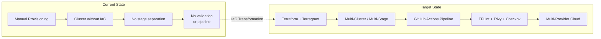

---

# 3. IaC Component Specification

## 3.1 Required Components

The following infrastructure components must be managed as IaC:

| Category | Component | Description | Managed by |
|----------|-----------|-------------|------------|
| **Cluster** | AKS / GKE / EKS | Managed Kubernetes cluster | Terraform + Terragrunt |
| **Network** | VNet / VPC, Subnets | Cluster virtual network | Terraform + Terragrunt |
| **Node Pools** | System + Workloads | Workload separation by pool | Terraform + Terragrunt |
| **DNS** | Azure DNS / Cloud DNS / Route53 | DNS zone for the environment | Terraform + Terragrunt |
| **Storage** | Storage Account / GCS / S3 | Terraform state backend | Terraform + Terragrunt |
| **Identity** | Managed Identity / Workload Identity / IAM Roles | Cluster identity and service accounts | Terraform + Terragrunt |
| **Namespaces** | Base cluster namespaces | Logical separation within the cluster | Terraform or Pulumi |
| **K8s Resources** | CRDs, ConfigMaps, RBAC, NetworkPolicies | Internal cluster resources | Pulumi (alternative) |
| **State** | Remote backend | Persistent Terraform state with locking | Terraform + Terragrunt |

## 3.2 IaC Components Diagram

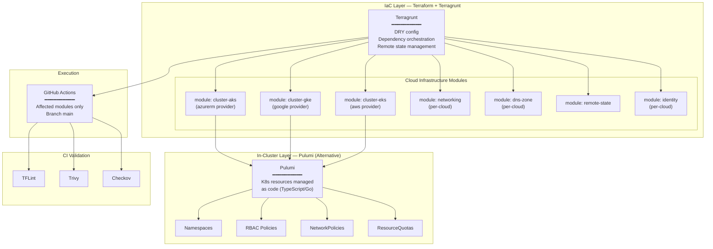

---

# 4. Tool Evaluation — IaC Alternatives

## 4.1 Terraform + Terragrunt (Primary)

**Terraform** with **Terragrunt** is the primary tool selected for cloud infrastructure provisioning.

**Terraform** provides:
- Mature official providers for Azure, GCP and AWS
- Declarative language (HCL) with extensive ecosystem
- Reusable modules and public registry
- Native tests (`terraform test`)
- Large community and documentation

**Terragrunt** adds:
- **DRY (Don't Repeat Yourself)**: eliminates configuration duplication between environments
- **Dependency orchestration**: executes modules in correct order automatically
- **Remote state management**: configures backends automatically per environment
- **Selective execution**: `terragrunt run-all` with `--filter-affected` to detect changes between the default branch and HEAD
- **Hooks**: `before_hook` / `after_hook` for validation and test integration

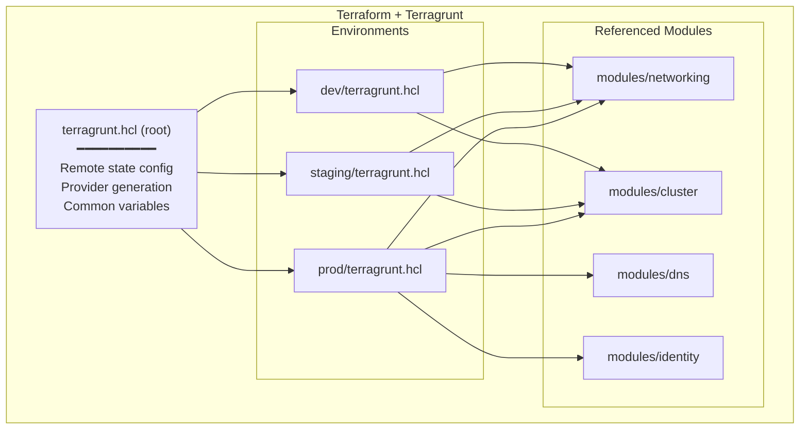

## 4.2 OpenTofu as a Valid Alternative

**OpenTofu** is an open-source fork of Terraform under MPL-2.0 license. It is a fully valid alternative:

| Aspect | Terraform | OpenTofu |
|--------|-----------|----------|
| License | BSL 1.1 (since v1.6) | MPL-2.0 |
| HCL compatibility | ✅ Native | ✅ Compatible |
| Providers | ✅ Official registry | ✅ Compatible |
| Terragrunt support | ✅ Full | ✅ Full |
| Maturity | ✅ Very high | ✅ High and growing |
| Enterprise support | ✅ HashiCorp | ⚠️ Community + sponsors |

> **Note:** when "Terraform" is mentioned, the recommendation applies equally if OpenTofu is chosen as the runtime. Terragrunt is compatible with both.

## 4.3 Pulumi for In-Cluster Resources

**Pulumi** is included as a complementary alternative for managing **internal Kubernetes resources** that the cluster itself needs as application components:

- Namespaces, RBAC, ConfigMaps, Secrets
- Base CRDs required by application components
- NetworkPolicies and ResourceQuotas
- Configurations that do not belong to the cloud infrastructure layer

**Advantages of Pulumi for this layer:**
- Programming in real languages (TypeScript, Go, Python)
- Native complex conditional logic and loops
- Native integration with the Kubernetes provider
- Can consume Terraform/Terragrunt outputs as inputs

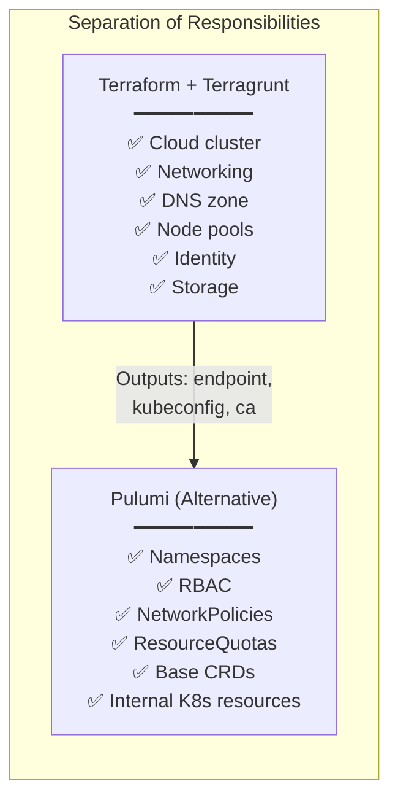

## 4.4 Comparative Matrix

| Criterion | Terraform + Terragrunt | OpenTofu + Terragrunt | Pulumi | AWS CDK / Bicep |
|-----------|----------------------|---------------------|--------|-----------------|
| **Role** | Cloud infra (primary) | Cloud infra (alternative) | In-cluster resources | ❌ Single-cloud |
| **Cloud-agnostic** | ✅ Multi-provider | ✅ Multi-provider | ✅ Multi-provider | ❌ Locked to one cloud |
| **DRY / orchestration** | ✅ Terragrunt | ✅ Terragrunt | ✅ Native (code) | ⚠️ Limited |
| **Selective execution** | ✅ Terragrunt --filter-affected | ✅ Terragrunt --filter-affected | ⚠️ Manual | ❌ No |
| **Native tests** | ✅ terraform test | ✅ tofu test | ✅ Unit tests | ⚠️ Partial |
| **Validation (TFLint, etc.)** | ✅ Full | ✅ Full | ⚠️ Different | ⚠️ Partial |

## 4.5 Decision Diagram

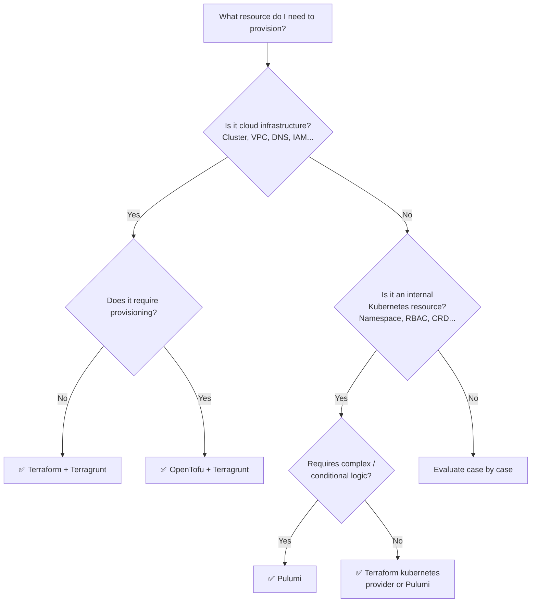

---

# 5. Cluster Design: Multi-Cluster vs Single Cluster

## 5.1 Option A: Multi-Cluster per Stage

Each stage (dev, staging, prod) has its own independent Kubernetes cluster.

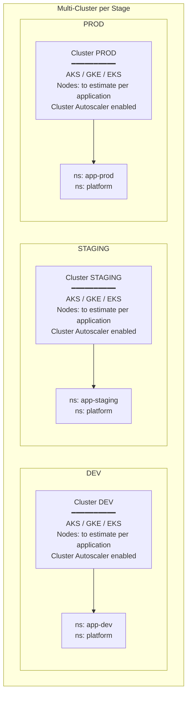

**Advantages:** total isolation, different sizing, independent upgrades, stricter security.
**Disadvantages:** higher cost (control plane × N), greater operational complexity.

## 5.2 Option B: Single Cluster with Namespace Separation

A single cluster with logical separation via namespaces, RBAC, NetworkPolicies and ResourceQuotas.

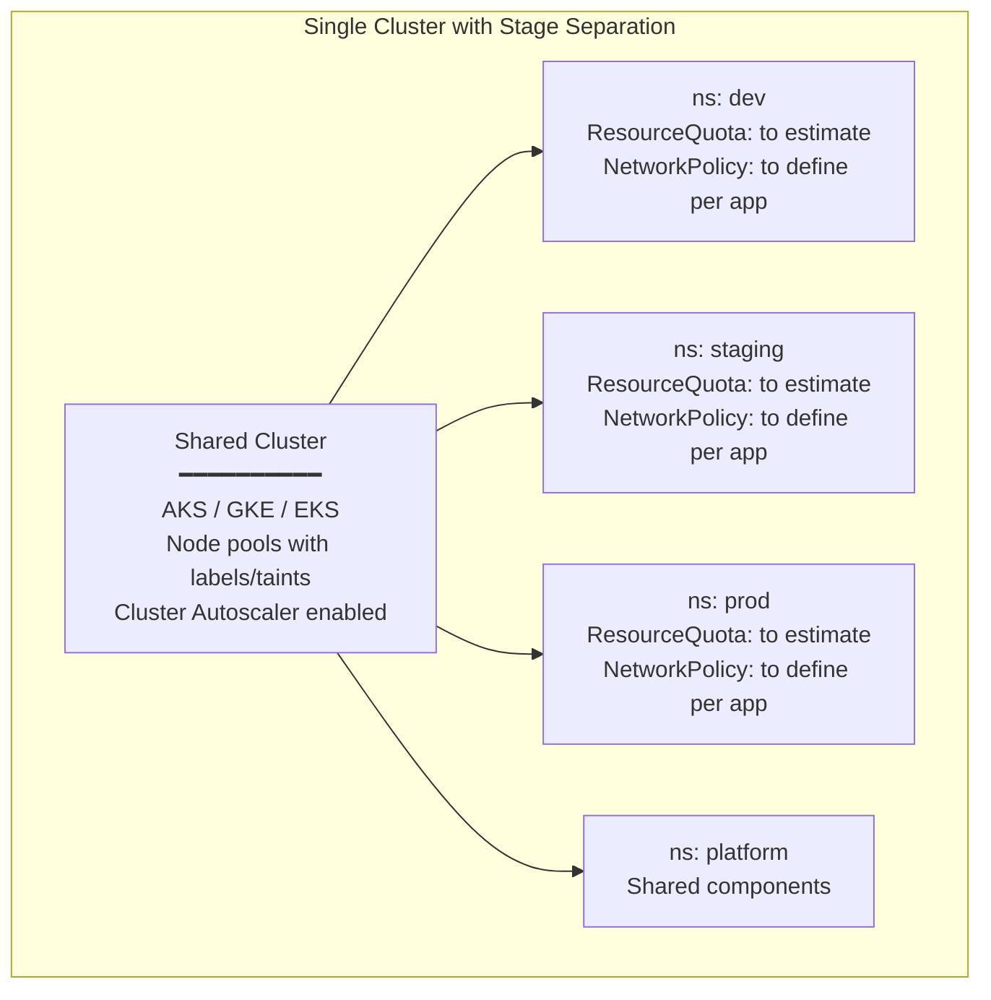

**Advantages:** significant cost reduction, lower operational complexity, simpler IaC.
**Disadvantages:** "noisy neighbor" risk, upgrade affects all stages, logical (not physical) isolation.

## 5.3 Comparison and Recommendation

| Criterion | Multi-Cluster | Single Cluster + Namespaces |
|-----------|---------------|---------------------------|
| **Cost** | ⚠️ Higher (N control planes) | ✅ Lower (1 control plane) |
| **Isolation** | ✅ Total | ⚠️ Logical (RBAC + NetworkPolicy) |
| **Operational complexity** | ⚠️ Higher | ✅ Lower |
| **IaC complexity** | ⚠️ More modules | ✅ Fewer modules |
| **Security** | ✅ Stricter by default | ⚠️ Requires additional configuration |
| **K8s upgrades** | ✅ Independent | ⚠️ Affects all stages |
| **Sizing** | ✅ Different per stage | ⚠️ Shared with quotas |

**Recommendation:** **hybrid** approach — shared cluster for dev+staging (cost optimization), separate cluster for prod (isolation).

## 5.4 Hybrid Approach Diagram

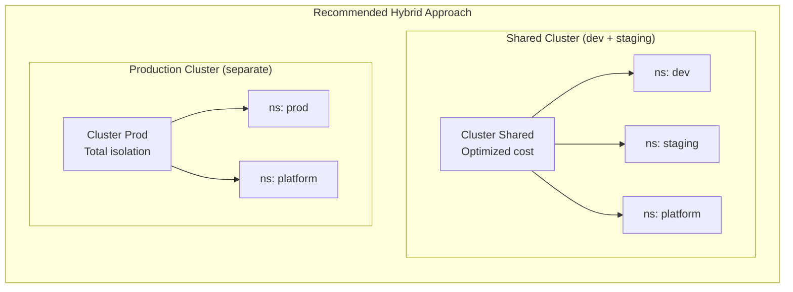

---

# 6. Solution & System Design

## 6.1 Global Provisioning Architecture

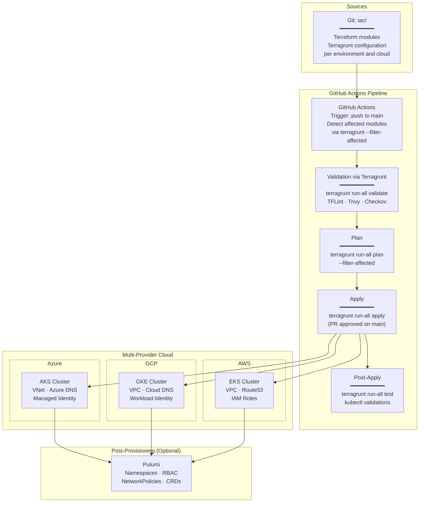

## 6.2 Internal Cluster Architecture

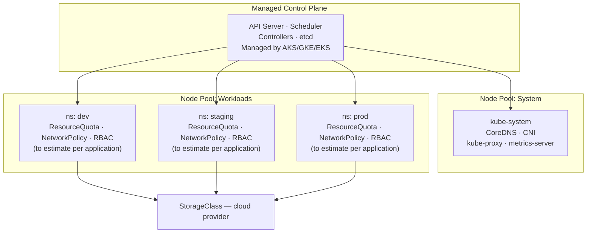

### Minimum infrastructure components per cluster

| Component | Description | Managed by |
|---|---|---|
| Control plane | API Server, etcd, scheduler, controllers | Cloud provider (managed) |
| System node pool | CoreDNS, CNI, kube-proxy, metrics-server | Terraform |
| Workloads node pool | Nodes for workloads | Terraform |
| Networking | VNet/VPC, Subnets, Security Groups/NSG | Terraform |
| DNS zone | DNS zone for the environment | Terraform |
| Identity | Managed Identity / Workload Identity / IAM | Terraform |
| StorageClass | Storage class | Terraform |
| Namespaces, RBAC, NetworkPolicies, ResourceQuotas | Stage separation and isolation (to estimate per application) | Terraform or Pulumi |

## 6.3 Repository Model and Project Structure

```mermaid
flowchart TB
    REPO["📁 Repository"]

    subgraph "Terraform Modules"
        MOD["iac/modules/"]

        subgraph "Azure"
            AZ_CLUSTER["azure/cluster/"]
            AZ_NET["azure/networking/"]
            AZ_DNS["azure/dns/"]
            AZ_ID["azure/identity/"]
            AZ_STATE["azure/remote-state/"]
        end

        subgraph "GCP"
            GCP_CLUSTER["gcp/cluster/"]
            GCP_NET["gcp/networking/"]
            GCP_DNS["gcp/dns/"]
            GCP_ID["gcp/identity/"]
            GCP_STATE["gcp/remote-state/"]
        end

        subgraph "AWS"
            AWS_CLUSTER["aws/cluster/"]
            AWS_NET["aws/networking/"]
            AWS_DNS["aws/dns/"]
            AWS_ID["aws/identity/"]
            AWS_STATE["aws/remote-state/"]
        end

        subgraph "Pulumi (Optional)"
            PULUMI_MOD["pulumi/<br/>Pulumi.yaml · index.ts"]
        end

        MOD --> AZ_CLUSTER
        MOD --> GCP_CLUSTER
        MOD --> AWS_CLUSTER
        MOD --> PULUMI_MOD
    end

    subgraph "Terragrunt Environments"
        LIVE["iac/live/"]

        AZ_DEV["azure/dev/"]
        AZ_STG["azure/staging/"]
        AZ_PROD["azure/prod/"]
        GCP_DEV["gcp/dev/"]
        GCP_PROD["gcp/prod/"]
        AWS_DEV["aws/dev/"]
        AWS_PROD["aws/prod/"]

        LIVE --> AZ_DEV
        LIVE --> AZ_STG
        LIVE --> AZ_PROD
        LIVE --> GCP_DEV
        LIVE --> GCP_PROD
        LIVE --> AWS_DEV
        LIVE --> AWS_PROD
    end

    REPO --> MOD
    REPO --> LIVE
```

### Detailed project structure

```text
repo/
├── iac/
│   ├── modules/
│   │   ├── azure/
│   │   │   ├── cluster/
│   │   │   │   ├── main.tf
│   │   │   │   ├── variables.tf
│   │   │   │   ├── outputs.tf
│   │   │   │   ├── versions.tf
│   │   │   │   └── tests/
│   │   │   │       └── cluster_test.tftest.hcl
│   │   │   ├── networking/
│   │   │   │   ├── main.tf
│   │   │   │   ├── variables.tf
│   │   │   │   └── outputs.tf
│   │   │   ├── dns/
│   │   │   │   ├── main.tf
│   │   │   │   ├── variables.tf
│   │   │   │   └── outputs.tf
│   │   │   ├── identity/
│   │   │   │   ├── main.tf
│   │   │   │   ├── variables.tf
│   │   │   │   └── outputs.tf
│   │   │   └── remote-state/
│   │   │       ├── main.tf
│   │   │       ├── variables.tf
│   │   │       └── outputs.tf
│   │   ├── gcp/
│   │   │   ├── cluster/
│   │   │   │   └── ... (same structure)
│   │   │   ├── networking/
│   │   │   ├── dns/
│   │   │   ├── identity/
│   │   │   └── remote-state/
│   │   ├── aws/
│   │   │   ├── cluster/
│   │   │   │   └── ... (same structure)
│   │   │   ├── networking/
│   │   │   ├── dns/
│   │   │   ├── identity/
│   │   │   └── remote-state/
│   │   └── pulumi/                          # (Optional) In-cluster resources
│   │       ├── Pulumi.yaml
│   │       ├── Pulumi.dev.yaml
│   │       ├── Pulumi.prod.yaml
│   │       └── index.ts
│   ├── live/
│   │   ├── terragrunt.hcl              # Root config (DRY)
│   │   ├── azure/
│   │   │   ├── dev/
│   │   │   │   ├── networking/terragrunt.hcl
│   │   │   │   ├── cluster/terragrunt.hcl
│   │   │   │   └── env.hcl
│   │   │   ├── staging/
│   │   │   │   └── ...
│   │   │   └── prod/
│   │   │       └── ...
│   │   ├── gcp/
│   │   │   └── ...
│   │   └── aws/
│   │       └── ...
│   └── .tflint.hcl
├── .github/
│   └── workflows/
│       ├── iac-validate.yml
│       ├── iac-plan.yml
│       └── iac-apply.yml
└── docs/
```

## 6.4 Provisioning Flow via GitHub Actions

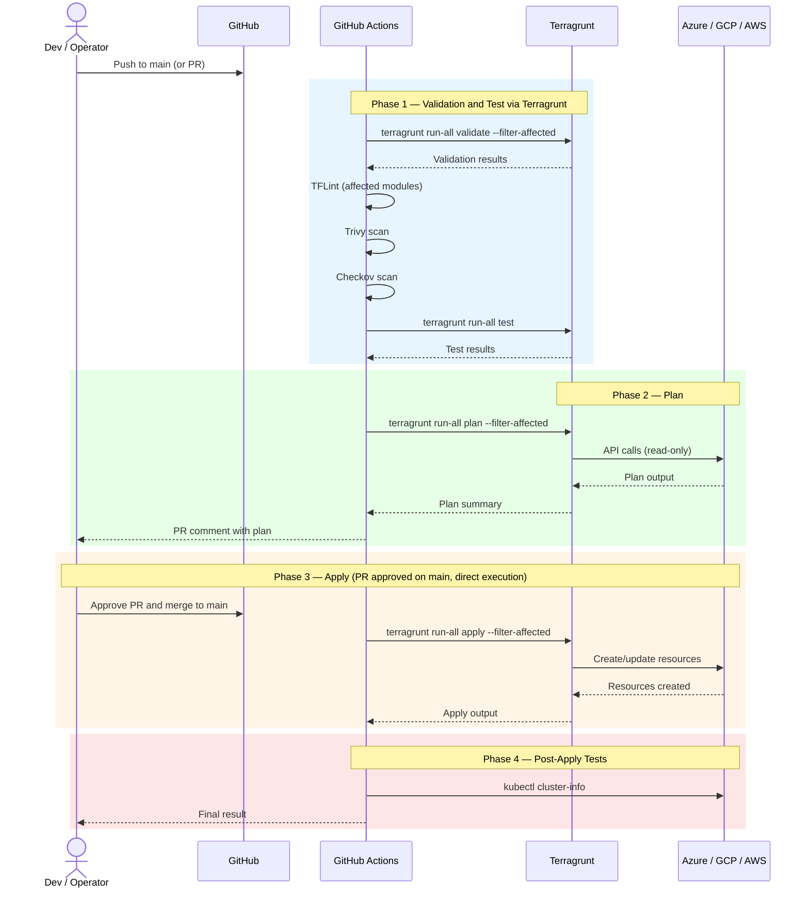

## 6.5 Optimized Execution: Affected Modules Only

Execution on `main` branch is optimized using Terragrunt's `--filter-affected` flag, which filters components that have been modified, added, or removed between the default branch (typically `main`) and HEAD. It is equivalent to using `--filter '[main...HEAD]'`:

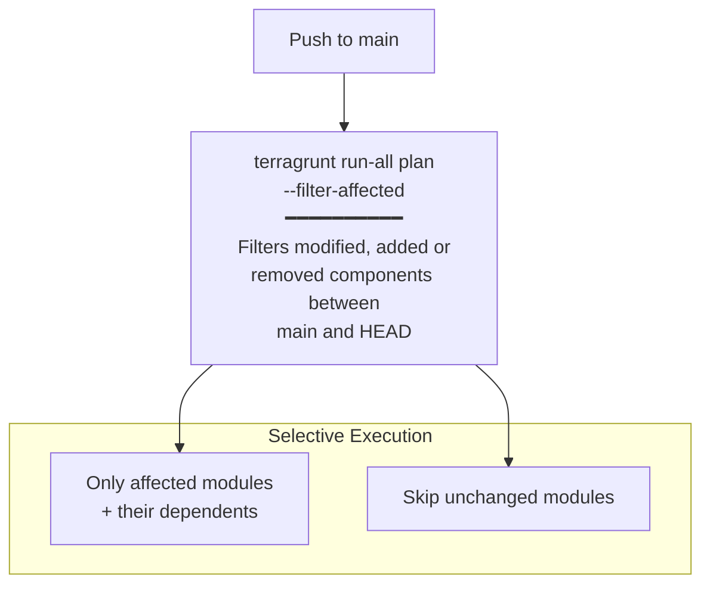

### GitHub Actions workflow example (extract):

```yaml
name: IaC Plan & Apply

on:
  push:
    branches: [main]
    paths:
      - 'iac/**'
  pull_request:
    paths: ['iac/**']

env:
  TF_VERSION: "1.9.0"
  TG_VERSION: "0.67.0"

jobs:
  validate:
    runs-on: ubuntu-latest
    steps:
      - uses: actions/checkout@v4
        with:
          fetch-depth: 0
      - name: Setup Terraform
        uses: hashicorp/setup-terraform@v3
        with:
          terraform_version: ${{ env.TF_VERSION }}
      - name: Terragrunt Validate (affected only)
        working-directory: iac/live
        run: terragrunt run-all validate --filter-affected
      - name: Terragrunt Tests (affected only)
        working-directory: iac/live
        run: terragrunt run-all test --filter-affected
      - name: TFLint
        run: |
          tflint --init --config=iac/.tflint.hcl
          tflint --recursive --config=iac/.tflint.hcl
      - name: Trivy
        run: trivy config iac/ --severity HIGH,CRITICAL --exit-code 1
      - name: Checkov
        run: checkov -d iac/ --framework terraform --compact

  plan:
    needs: validate
    runs-on: ubuntu-latest
    steps:
      - uses: actions/checkout@v4
        with:
          fetch-depth: 0
      - name: Terragrunt Plan (affected only)
        working-directory: iac/live
        run: terragrunt run-all plan --filter-affected --terragrunt-non-interactive

  apply:
    needs: plan
    if: github.ref == 'refs/heads/main'
    runs-on: ubuntu-latest
    steps:
      - uses: actions/checkout@v4
        with:
          fetch-depth: 0
      - name: Terragrunt Apply (affected only)
        working-directory: iac/live
        run: terragrunt run-all apply --filter-affected --terragrunt-non-interactive

  post-apply:
    needs: apply
    runs-on: ubuntu-latest
    steps:
      - uses: actions/checkout@v4
      - name: Kubectl Validation
        run: |
          kubectl cluster-info
          kubectl get nodes
          kubectl get ns
```

## 6.6 Recommended Final Toolchain

| Layer | Tool | Responsibility |
|---|---|---|
| Cloud infrastructure | **Terraform + Terragrunt** | Create clusters, networking, DNS, identity, storage |
| IaC alternative | **OpenTofu + Terragrunt** | Same functionality, open-source license |
| In-cluster resources | **Pulumi** (alternative) | Namespaces, RBAC, NetworkPolicies, CRDs |
| Code validation | **TFLint** | HCL linting and best practices |
| IaC security | **Trivy** | Security misconfiguration detection |
| IaC compliance | **Checkov** | Compliance policies and best practices |
| CI/CD | **GitHub Actions** | Automated pipeline with optimized execution |
| Tests | **terraform test via Terragrunt** | Native infrastructure tests |

---

# 7. IaC Validation and Security Tools

## 7.1 TFLint

**TFLint** is a linter for Terraform/HCL files.

- Detects syntax and semantic errors before `plan`
- Validates naming conventions and best practices
- Cloud provider-specific plugins (azurerm, google, aws)
- Integrates with GitHub Actions and pre-commit hooks

```hcl
# .tflint.hcl
plugin "terraform" {
  enabled = true
  preset  = "recommended"
}

plugin "azurerm" {
  enabled = true
  version = "0.27.0"
  source  = "github.com/terraform-linters/tflint-ruleset-azurerm"
}

plugin "google" {
  enabled = true
  version = "0.30.0"
  source  = "github.com/terraform-linters/tflint-ruleset-google"
}

plugin "aws" {
  enabled = true
  version = "0.32.0"
  source  = "github.com/terraform-linters/tflint-ruleset-aws"
}
```

## 7.2 Trivy

**Trivy** detects vulnerabilities and security misconfigurations in IaC code.

- Scans Terraform files to detect insecure configurations
- Reports severity (CRITICAL, HIGH, MEDIUM, LOW)
- Supports multiple output formats (JSON, table)

```bash
# Execution example
trivy config iac/ --severity HIGH,CRITICAL --exit-code 1
```

## 7.3 Checkov

**Checkov** is a static policy analyzer for IaC.

- +1000 built-in policies for Terraform
- Detects compliance issues (CIS benchmarks, SOC2, HIPAA)
- Support for custom policies in Python or YAML
- Integrates with GitHub Actions and generates reports

```bash
# Execution example
checkov -d iac/ --framework terraform --compact
```

## 7.4 Validation Pipeline

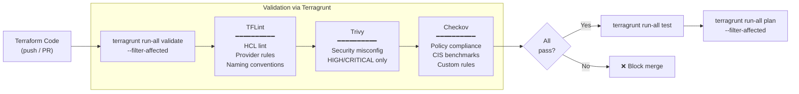

---

# 8. Terraform Testing Concept

## 8.1 Infrastructure Validation Suite

| ID | Test | Command / method | Expected result |
|---|---|---|---|
| I01 | Cluster accessible | `kubectl cluster-info` | API server responds |
| I02 | Nodes available | `kubectl get nodes` | Nodes `Ready` in all pools |
| I03 | Namespaces created | `kubectl get ns` | Base namespaces present |
| I04 | CoreDNS operational | `kubectl -n kube-system get pods` | Pods `Running` |
| I05 | State backend | Verify storage account / bucket / S3 | Remote state accessible |
| I06 | DNS zone configured | Cloud provider CLI | Zone active |
| I07 | Networking | Verify VNet/VPC and subnets | Resources created correctly |
| I08 | Identity | Verify Managed Identity / WI / IAM Role | Configured and associated |
| I09 | RBAC | `kubectl auth can-i` per namespace | Correct permissions |
| I10 | NetworkPolicies | `kubectl get networkpolicies -A` | Policies applied |
| I11 | ResourceQuotas | `kubectl get resourcequotas -A` | Quotas configured |

## 8.2 Native Terraform Tests

Terraform supports native tests with `.tftest.hcl` files:

```hcl
# tests/cluster_test.tftest.hcl

variables {
  cluster_name       = "test-cluster"
  region             = "westeurope"
  kubernetes_version = "1.29"
  node_count         = 1
  machine_type       = "Standard_D2s_v3"
}

run "cluster_creates_successfully" {
  command = plan

  assert {
    condition     = azurerm_kubernetes_cluster.main.name == "test-cluster"
    error_message = "Cluster name does not match"
  }

  assert {
    condition     = azurerm_kubernetes_cluster.main.location == "westeurope"
    error_message = "Cluster region does not match"
  }
}

run "node_pool_configured" {
  command = plan

  assert {
    condition     = azurerm_kubernetes_cluster_node_pool.workloads.node_count == 1
    error_message = "Node count does not match"
  }
}
```

Execution:

```bash
terraform test
```

## 8.3 Test Execution via Terragrunt

Tests are integrated into the Terragrunt flow using hooks and the `terragrunt run-all test` command:

```hcl
# terragrunt.hcl (root)
terraform {
  after_hook "terraform_test" {
    commands = ["apply"]
    execute  = ["terraform", "test"]
  }

  before_hook "terraform_validate" {
    commands = ["plan", "apply"]
    execute  = ["terraform", "validate"]
  }

  before_hook "tflint" {
    commands = ["plan"]
    execute  = ["tflint", "--init"]
  }
}
```

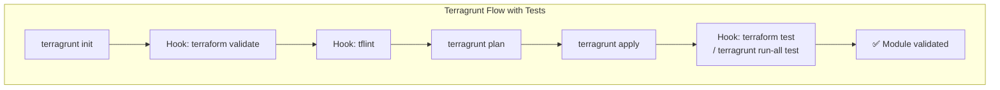

---

# 9. Multi-Provider Cloud Execution

## 9.1 Multi-Cloud Strategy

The IaC automation supports multiple cloud providers with the same module pattern and the same Terragrunt structure. Differences are **encapsulated** within each cloud-specific module.

## 9.2 Portability Matrix

| Aspect | Azure (AKS) | GCP (GKE) | AWS (EKS) | Portability |
|--------|-------------|-----------|-----------|-------------|
| Cluster creation | `azurerm_kubernetes_cluster` | `google_container_cluster` | `aws_eks_cluster` | Different module, same contract |
| Networking | VNet + Subnet | VPC + Subnet | VPC + Subnet | Different module, same contract |
| DNS | Azure DNS | Cloud DNS | Route53 | Different module, same contract |
| Identity | Managed Identity | Workload Identity | IAM Roles / IRSA | Different config |
| Storage (state) | Azure Blob | GCS | S3 | Terragrunt abstracts it |
| Container Registry | ACR | Artifact Registry | ECR | Different config |
| Node pools | AKS node pools | GKE node pools | EKS managed node groups | Different module |

## 9.3 Multi-Provider Diagram

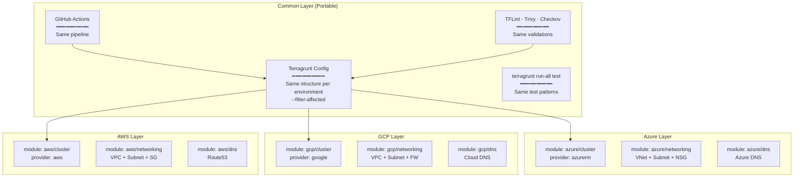

### Common variable contract between providers

```hcl
variable "cluster_name" {
  type        = string
  description = "Name of the Kubernetes cluster"
}

variable "region" {
  type        = string
  description = "Cloud region for the cluster"
}

variable "kubernetes_version" {
  type        = string
  description = "Kubernetes version"
}

variable "environment" {
  type        = string
  description = "Environment name (dev, staging, prod)"
}

variable "node_count_system" {
  type        = number
  description = "Number of nodes in system pool"
}

variable "node_count_workloads" {
  type        = number
  description = "Number of nodes in workloads pool"
}

variable "machine_type" {
  type        = string
  description = "VM size / machine type for nodes"
}
```

---

# 10. Scope Definition

## 10.1 In Scope

- IaC automation to create Kubernetes clusters across multiple cloud providers (AKS, GKE, EKS)
- Terraform + Terragrunt project structure with per-environment and per-cloud separation
- Multi-cluster / single cluster stage separation strategy design
- GitHub Actions pipeline with optimized execution via `--filter-affected`
- Validation tool integration: TFLint, Trivy, Checkov
- Native Terraform tests and execution via Terragrunt (`terragrunt run-all test`)
- OpenTofu evaluation as alternative and Pulumi for in-cluster resources
- Documented provisioning runbook
- Multi-provider cloud evaluation with documented limitations

## 10.2 Out of Scope

- Application deployment within the cluster
- Installation and operation of tools like Argo CD, ingress-nginx, cert-manager
- Full day-2 operations
- Advanced observability
- Service mesh
- Exhaustive cluster hardening
- Production application deployment

---

## NOTICE

This work is licensed under the [CC-BY-4.0](https://creativecommons.org/licenses/by/4.0/legalcode).

* SPDX-License-Identifier: CC-BY-4.0
* SPDX-FileCopyrightText: 2026 Contributors to the Eclipse Foundation
* Source URL: <https://github.com/eclipse-tractusx/tractus-x-umbrella>
