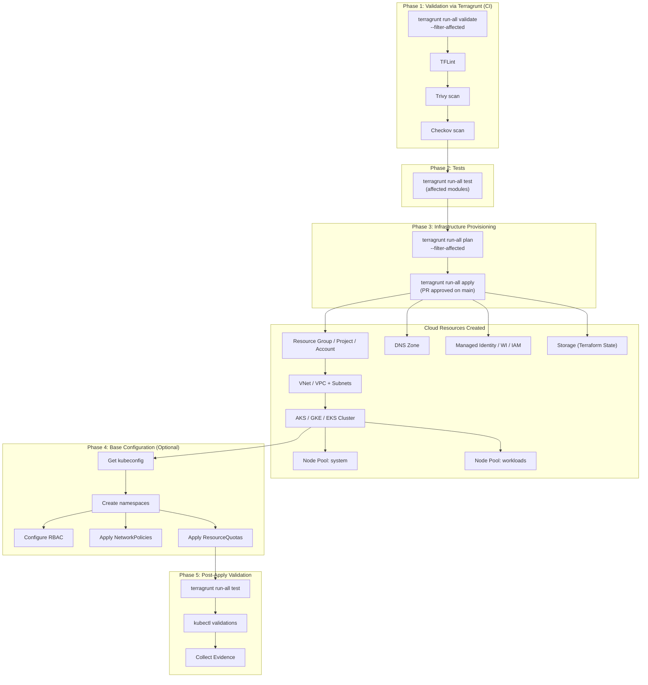
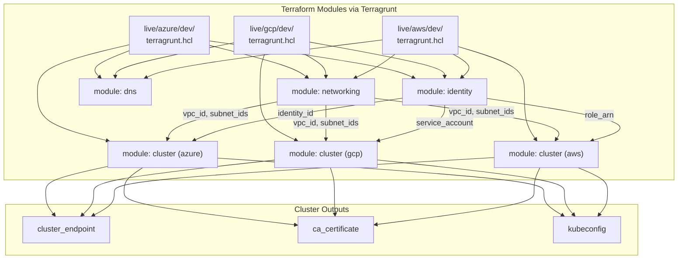
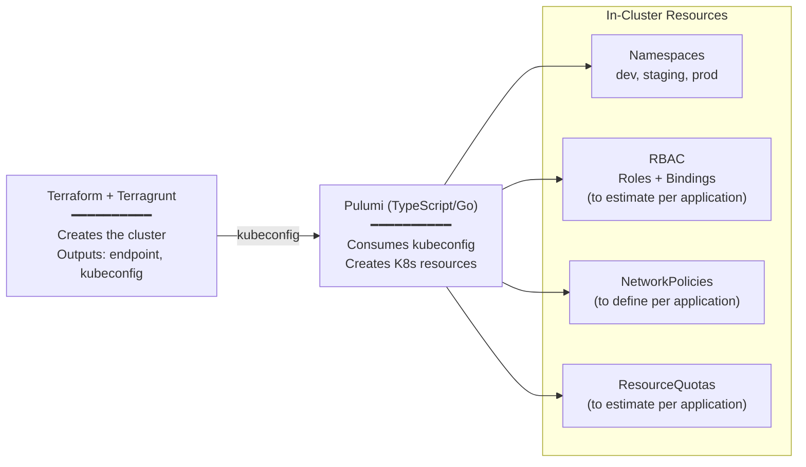
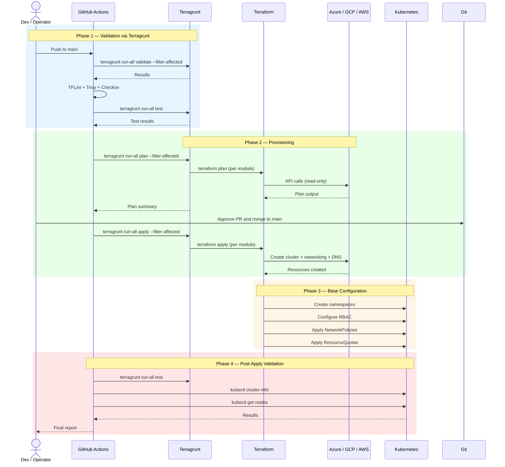
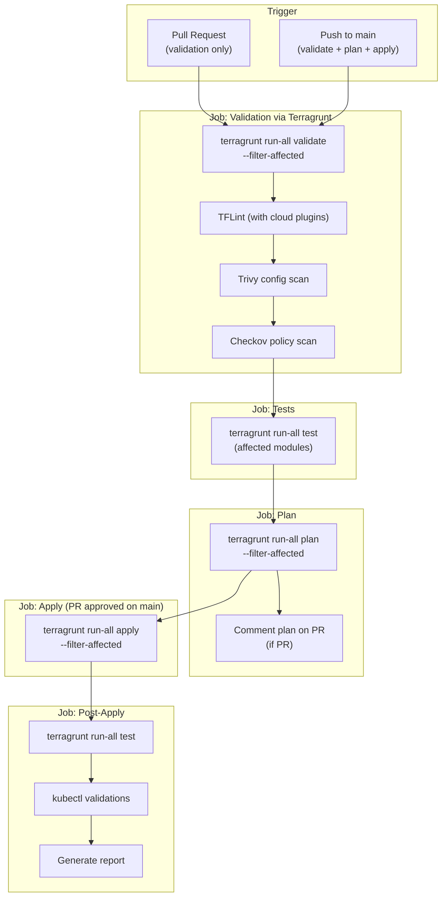
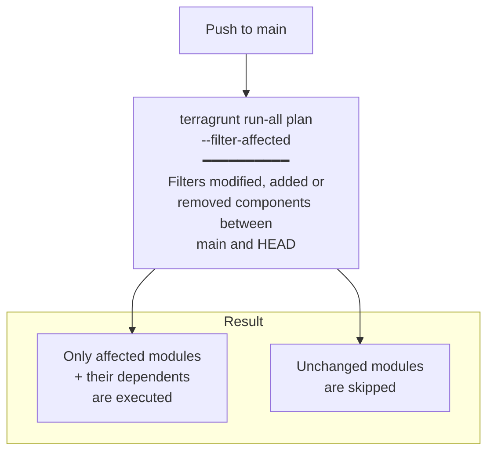
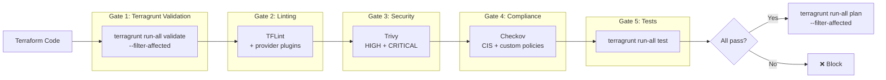
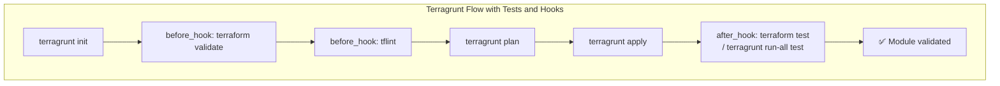
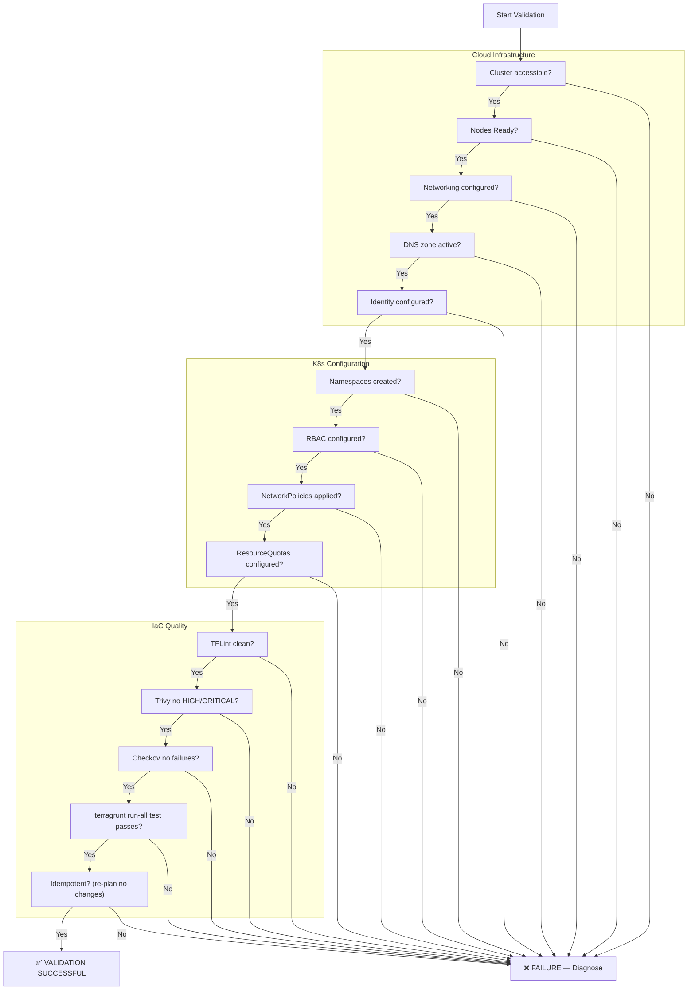

# Solution Design: IaC Automation Implementation

<!-- TOC -->
* [1. Business Case](#1-business-case)
  * [1.1 Executive Summary](#11-executive-summary)
  * [1.2 Objective](#12-objective)
  * [1.3 Deliverables](#13-deliverables)
  * [1.4 Indicative Action Plan](#14-indicative-action-plan)
  * [1.5 Assumptions and Prerequisites](#15-assumptions-and-prerequisites)
  * [1.6 Limitations](#16-limitations)
* [2. Implementation Architecture](#2-implementation-architecture)
  * [2.1 IaC Automation Flow Diagram](#21-iac-automation-flow-diagram)
  * [2.2 Implemented Terraform Modules](#22-implemented-terraform-modules)
  * [2.3 Module Dependencies Diagram](#23-module-dependencies-diagram)
  * [2.4 Pulumi Role for In-Cluster Resources](#24-pulumi-role-for-in-cluster-resources)
* [3. Provisioning Runbook](#3-provisioning-runbook)
  * [3.1 Prerequisites](#31-prerequisites)
  * [3.2 Phase A — Cluster Provisioning](#32-phase-a--cluster-provisioning)
  * [3.3 Phase B — Base Cluster Configuration](#33-phase-b--base-cluster-configuration)
  * [3.4 Phase C — Validation](#34-phase-c--validation)
  * [3.5 Summarized Execution Example](#35-summarized-execution-example)
  * [3.6 Definition of "Done"](#36-definition-of-done)
  * [3.7 Runbook Sequence Diagram](#37-runbook-sequence-diagram)
* [4. GitHub Actions Pipeline](#4-github-actions-pipeline)
  * [4.1 Complete Pipeline Diagram](#41-complete-pipeline-diagram)
  * [4.2 Optimized Execution on main](#42-optimized-execution-on-main)
  * [4.3 Workflow Example](#43-workflow-example)
* [5. Integrated Validation Tools](#5-integrated-validation-tools)
  * [5.1 Tools Summary](#51-tools-summary)
  * [5.2 TFLint Configuration](#52-tflint-configuration)
  * [5.3 Validation Flow Diagram](#53-validation-flow-diagram)
* [6. Test Suite and Validation Report](#6-test-suite-and-validation-report)
  * [6.1 Infrastructure Test Matrix](#61-infrastructure-test-matrix)
  * [6.2 Native Terraform Tests](#62-native-terraform-tests)
  * [6.3 Test Execution via Terragrunt](#63-test-execution-via-terragrunt)
  * [6.4 Minimum Evidence](#64-minimum-evidence)
  * [6.5 Post-Apply Validation Flow Diagram](#65-post-apply-validation-flow-diagram)
* [7. Common Multi-Cloud Contract](#7-common-multi-cloud-contract)
* [8. Scope and Limitations Alignment](#8-scope-and-limitations-alignment)
* [9. Final Recommendation](#9-final-recommendation)
* [NOTICE](#notice)
<!-- TOC -->

---

## Metadata

* **Date:** 2026
* **Dependencies:** Kubernetes (AKS/GKE/EKS), Terraform, Terragrunt, OpenTofu (alternative), Pulumi (in-cluster resources)
* **Target group:** Platform architecture, DevOps, Infrastructure engineering
* **CI/CD:** GitHub Actions
* **IaC Validation:** TFLint, Trivy, Checkov
* **Prerequisite:** Approved exploration concept

---

# 1. Business Case

## 1.1 Executive Summary

This document describes the implementation of the IaC automation designed in the exploration phase. Its goal is to deliver successfully provisioned IaC components in the target Kubernetes environments, including the automation, the execution runbook, the GitHub Actions pipeline, and the validation test suite.

## 1.2 Objective

| **Objective** | IaC components successfully provided in the target Kubernetes environments per the exploration concept specification. |
|----------|-----------------------------------------------------------------------------------------------------------------------------------|

## 1.3 Deliverables

| # | Deliverable | Description |
|---|-----------|-------------|
| 1 | **IaC Automation** | Terraform + Terragrunt for multi-cloud cluster provisioning |
| 2 | **GitHub Actions Pipeline** | CI/CD with validation, plan and optimized apply |
| 3 | **Execution Guide (Runbook)** | For complete provisioning |
| 4 | **Test suite and report** | Terraform tests via Terragrunt + infrastructure validation |

## 1.4 Indicative Action Plan

1. Development of Terraform modules for each cloud provider (AKS, GKE, EKS)
2. Terragrunt configuration for DRY orchestration between environments
3. GitHub Actions pipeline implementation with optimized execution via `--filter-affected`
4. TFLint, Trivy and Checkov integration in the pipeline
5. Development of native Terraform tests and execution via Terragrunt
6. Automated cluster provisioning in target environments
7. Technical documentation creation (runbook)
8. Test execution for provisioning validation
9. Client review
10. Technical acceptance

## 1.5 Assumptions and Prerequisites

- Access to target cloud environments (Azure, GCP, AWS) is guaranteed
- Necessary permissions for IaC automation execution exist
- The exploration concept is approved and serves as the basis
- GitHub repository with Actions enabled
- Service principals / service accounts configured for CI/CD
- The implementation targets a technical maturity level of **TRL 7**

## 1.6 Limitations

- **No** application deployment within the cluster
- **No** installation of tools like Argo CD, ingress-nginx, etc. (out of scope)
- **No** operation or monitoring of the provided environment
- The IaC automation is designed for execution in provisioned cloud environments

---

# 2. Implementation Architecture

## 2.1 IaC Automation Flow Diagram



## 2.2 Implemented Terraform Modules

| Module | Location | Responsibility | Providers |
|--------|----------|----------------|-----------|
| `cluster` | `iac/modules/azure/cluster/` | AKS cluster, node pools | `azurerm` |
| `cluster` | `iac/modules/gcp/cluster/` | GKE cluster, node pools | `google` |
| `cluster` | `iac/modules/aws/cluster/` | EKS cluster, managed node groups | `aws` |
| `networking` | `iac/modules/{provider}/networking/` | VNet/VPC, subnets, security groups | Per-cloud |
| `dns` | `iac/modules/{provider}/dns/` | DNS zone | Per-cloud |
| `identity` | `iac/modules/{provider}/identity/` | Managed Identity / Workload Identity / IAM | Per-cloud |
| `remote-state` | `iac/modules/{provider}/remote-state/` | Remote backend for Terraform state | Per-cloud |
| `pulumi` | `iac/modules/pulumi/` (optional) | In-cluster K8s resources | Kubernetes |

## 2.3 Module Dependencies Diagram



## 2.4 Pulumi Role for In-Cluster Resources

Optionally, **Pulumi** is used to manage internal Kubernetes resources that complement the cluster infrastructure:



---

# 3. Provisioning Runbook

## 3.1 Prerequisites

| Prerequisite | Required | Notes |
|---|---|---|
| Access to target cloud | Yes | Azure, GCP, or AWS |
| Service principal / service account | Yes | For Terraform and GitHub Actions |
| Remote state backend | Yes | Azure Blob / GCS / S3 |
| GitHub repository with Actions | Yes | Automated pipeline |
| Terraform + Terragrunt installed | Yes | For local / CI execution |
| TFLint + Trivy + Checkov | Yes | For validation |

## 3.2 Phase A — Cluster Provisioning

1. Select the environment (`iac/live/azure/dev`, `iac/live/gcp/dev`, etc.)
2. Run `terragrunt run-all init`
3. Run `terragrunt run-all plan --filter-affected` and review changes
4. Run `terragrunt run-all apply --filter-affected`
5. Obtain endpoint, CA, kubeconfig and evidence

## 3.3 Phase B — Base Cluster Configuration

1. Create namespaces per stage (dev, staging, prod) — via Terraform or Pulumi
2. Configure RBAC per namespace (to estimate per application)
3. Apply isolation NetworkPolicies (to define per application)
4. Apply ResourceQuotas (to estimate per application)
5. Verify configuration

## 3.4 Phase C — Validation

1. Run `terragrunt run-all test` to validate modules
2. Verify cluster accessible with `kubectl cluster-info`
3. Verify nodes, namespaces, RBAC
4. Collect evidence for acceptance

## 3.5 Summarized Execution Example

```bash
# Phase A — Provisioning via Terragrunt
cd iac/live/azure/dev
terragrunt run-all init
terragrunt run-all plan --filter-affected
terragrunt run-all apply --filter-affected

# Phase B — Cluster validation
export KUBECONFIG=$(terragrunt output -raw kubeconfig_path)
kubectl cluster-info
kubectl get nodes
kubectl get ns

# Phase B — Base configuration validation
kubectl get networkpolicies -A
kubectl get resourcequotas -A
kubectl auth can-i list pods --namespace=dev --as=dev-user

# Phase C — Terraform tests via Terragrunt
terragrunt run-all test

# Phase C — Final validations
kubectl get nodes -o wide
kubectl top nodes
```

## 3.6 Definition of "Done"

Provisioning is considered technically correct when:

- ✅ The cluster exists and is accessible
- ✅ Node pools are in `Ready` state
- ✅ Namespaces are created with RBAC, NetworkPolicies and ResourceQuotas
- ✅ Terraform tests pass correctly (`terragrunt run-all test`)
- ✅ TFLint, Trivy and Checkov report no critical issues
- ✅ Evidence is archived

## 3.7 Runbook Sequence Diagram



---

# 4. GitHub Actions Pipeline

## 4.1 Complete Pipeline Diagram



## 4.2 Optimized Execution on main

Only affected modules are executed, using Terragrunt's `--filter-affected` flag. This flag filters components that have been modified, added, or removed between the default branch (typically `main`) and HEAD. It is equivalent to using `--filter '[main...HEAD]'`:



## 4.3 Workflow Example

```yaml
name: IaC Pipeline

on:
  push:
    branches: [main]
    paths: ['iac/**']
  pull_request:
    paths: ['iac/**']

env:
  TF_VERSION: "1.9.0"
  TG_VERSION: "0.67.0"

jobs:
  validate:
    runs-on: ubuntu-latest
    steps:
      - uses: actions/checkout@v4
        with:
          fetch-depth: 0
      - name: Setup Terraform
        uses: hashicorp/setup-terraform@v3
        with:
          terraform_version: ${{ env.TF_VERSION }}
      - name: Terragrunt Validate (affected only)
        working-directory: iac/live
        run: terragrunt run-all validate --filter-affected
      - name: TFLint
        run: |
          tflint --init --config=iac/.tflint.hcl
          tflint --recursive --config=iac/.tflint.hcl
      - name: Trivy
        run: trivy config iac/ --severity HIGH,CRITICAL --exit-code 1
      - name: Checkov
        run: checkov -d iac/ --framework terraform --compact
      - name: Terragrunt Tests (affected only)
        working-directory: iac/live
        run: terragrunt run-all test --filter-affected

  plan:
    needs: validate
    runs-on: ubuntu-latest
    steps:
      - uses: actions/checkout@v4
        with:
          fetch-depth: 0
      - name: Terragrunt Plan (affected only)
        working-directory: iac/live
        run: terragrunt run-all plan --filter-affected --terragrunt-non-interactive

  apply:
    needs: plan
    if: github.ref == 'refs/heads/main'
    runs-on: ubuntu-latest
    steps:
      - uses: actions/checkout@v4
        with:
          fetch-depth: 0
      - name: Terragrunt Apply (affected only)
        working-directory: iac/live
        run: terragrunt run-all apply --filter-affected --terragrunt-non-interactive

  post-apply:
    needs: apply
    runs-on: ubuntu-latest
    steps:
      - uses: actions/checkout@v4
      - name: Kubectl Validation
        run: |
          kubectl cluster-info
          kubectl get nodes
          kubectl get ns
```

---

# 5. Integrated Validation Tools

## 5.1 Tools Summary

| Tool | Purpose | What it detects | Integration |
|---|---|---|---|
| **TFLint** | HCL linting | Syntax errors, naming, best practices, provider-specific rules | GitHub Actions, pre-commit |
| **Trivy** | IaC security | Security misconfigurations, known vulnerabilities | GitHub Actions |
| **Checkov** | Compliance | CIS, SOC2, HIPAA policies, custom rules | GitHub Actions |

## 5.2 TFLint Configuration

```hcl
# iac/.tflint.hcl
plugin "terraform" {
  enabled = true
  preset  = "recommended"
}

plugin "azurerm" {
  enabled = true
  version = "0.27.0"
  source  = "github.com/terraform-linters/tflint-ruleset-azurerm"
}

plugin "google" {
  enabled = true
  version = "0.30.0"
  source  = "github.com/terraform-linters/tflint-ruleset-google"
}

plugin "aws" {
  enabled = true
  version = "0.32.0"
  source  = "github.com/terraform-linters/tflint-ruleset-aws"
}
```

## 5.3 Validation Flow Diagram



---

# 6. Test Suite and Validation Report

## 6.1 Infrastructure Test Matrix

| ID | Test | Command / method | Expected result |
|---|---|---|---|
| I01 | Cluster accessible | `kubectl cluster-info` | API server responds |
| I02 | Nodes available | `kubectl get nodes` | Nodes `Ready` in all pools |
| I03 | Namespaces created | `kubectl get ns` | Per-stage namespaces present |
| I04 | CoreDNS operational | `kubectl -n kube-system get pods` | Pods `Running` |
| I05 | State backend | Verify storage backend | Remote state accessible |
| I06 | DNS zone configured | Cloud provider CLI | Zone active |
| I07 | Networking | Verify VNet/VPC and subnets | Resources created |
| I08 | Identity | Verify associated identity | Configured |
| I09 | RBAC | `kubectl auth can-i` per namespace | Correct permissions |
| I10 | NetworkPolicies | `kubectl get networkpolicies -A` | Policies applied |
| I11 | ResourceQuotas | `kubectl get resourcequotas -A` | Quotas configured |
| I12 | Terraform Tests | `terragrunt run-all test` | All tests pass |
| I13 | TFLint | `tflint --recursive` | No errors |
| I14 | Trivy | `trivy config` | No HIGH/CRITICAL |
| I15 | Checkov | `checkov -d iac/` | No critical failures |
| I16 | Idempotency | `terragrunt run-all plan` (re-run) | No pending changes |

## 6.2 Native Terraform Tests

```hcl
# modules/azure/cluster/tests/cluster_test.tftest.hcl

variables {
  cluster_name       = "test-cluster"
  region             = "westeurope"
  kubernetes_version = "1.29"
  environment        = "dev"
  node_count_system  = 2
  node_count_workloads = 2
  machine_type       = "Standard_D2s_v3"
}

run "cluster_creates_successfully" {
  command = plan

  assert {
    condition     = azurerm_kubernetes_cluster.main.name == "test-cluster"
    error_message = "Cluster name does not match"
  }

  assert {
    condition     = azurerm_kubernetes_cluster.main.location == "westeurope"
    error_message = "Region does not match"
  }
}

run "node_pools_configured" {
  command = plan

  assert {
    condition     = azurerm_kubernetes_cluster_node_pool.system.node_count == 2
    error_message = "System node count incorrect"
  }

  assert {
    condition     = azurerm_kubernetes_cluster_node_pool.workloads.node_count == 2
    error_message = "Workload node count incorrect"
  }
}
```

## 6.3 Test Execution via Terragrunt

```hcl
# root terragrunt.hcl
terraform {
  after_hook "run_tests" {
    commands = ["apply"]
    execute  = ["terraform", "test"]
  }

  before_hook "validate" {
    commands = ["plan", "apply"]
    execute  = ["terraform", "validate"]
  }

  before_hook "lint" {
    commands = ["plan"]
    execute  = ["tflint", "--init"]
  }
}
```

Direct execution of all tests:

```bash
terragrunt run-all test
```



## 6.4 Minimum Evidence

- Output from `terragrunt run-all plan` and `terragrunt run-all apply`
- TFLint, Trivy, Checkov results
- `terragrunt run-all test` results
- `kubectl cluster-info` and `kubectl get nodes`
- `kubectl get ns`
- `kubectl get networkpolicies -A` and `kubectl get resourcequotas -A`
- Observations and limitations found

## 6.5 Post-Apply Validation Flow Diagram



---

# 7. Common Multi-Cloud Contract

```hcl
variable "cluster_name" {
  type        = string
  description = "Name of the Kubernetes cluster"
}

variable "region" {
  type        = string
  description = "Cloud region for the cluster"
}

variable "kubernetes_version" {
  type        = string
  description = "Kubernetes version"
}

variable "environment" {
  type        = string
  description = "Environment name (dev, staging, prod)"
}

variable "node_count_system" {
  type        = number
  description = "Number of nodes in system pool"
}

variable "node_count_workloads" {
  type        = number
  description = "Number of nodes in workloads pool"
}

variable "machine_type" {
  type        = string
  description = "VM size / machine type"
}
```

The variable contract is identical for all providers. Implementation differences are encapsulated within each cloud-specific module.

---

# 8. Scope and Limitations Alignment

| In scope | How it's covered |
|---|---|
| Multi-cloud IaC automation | Terraform + Terragrunt with per-provider modules |
| CI/CD pipeline | GitHub Actions with `--filter-affected` |
| Code validation | TFLint, Trivy, Checkov integrated |
| Infrastructure tests | `terragrunt run-all test` + kubectl validations |
| Runbook | Documented in phases A/B/C |
| Multi-cloud | Common contract with encapsulated per-provider modules |

| Out of scope | Treatment |
|---|---|
| Application deployment | Not included — responsibility of another team/phase |
| Platform tools (Argo CD, ingress, etc.) | Not included |
| Day-2 operations | Provisioning and initial validation only |
| Exhaustive hardening | Minimum for demo/validation |

---

# 9. Final Recommendation

1. **Terraform + Terragrunt** is the primary toolchain for multi-cloud infrastructure provisioning
2. **OpenTofu** is a valid alternative if open-source license is required
3. **Pulumi** complements for internal Kubernetes resources
4. **GitHub Actions** executes the pipeline with `--filter-affected` for optimized execution
5. **TFLint + Trivy + Checkov** form the quality and security gate
6. **terragrunt run-all test** + `kubectl` validations ensure post-apply correctness

### Responsibility Pattern

| Domain | Tool |
|---|---|
| Cloud provisioning | Terraform + Terragrunt |
| In-cluster resources | Pulumi (alternative) |
| Code validation | TFLint + Trivy + Checkov |
| CI/CD pipeline | GitHub Actions |
| Infrastructure tests | terragrunt run-all test |
| Post-apply validation | kubectl + smoke tests |

---

## NOTICE

This work is licensed under the [CC-BY-4.0](https://creativecommons.org/licenses/by/4.0/legalcode).

* SPDX-License-Identifier: CC-BY-4.0
* SPDX-FileCopyrightText: 2026 Contributors to the Eclipse Foundation
* Source URL: <https://github.com/eclipse-tractusx/tractus-x-umbrella>
