# Infrastructure Architecture, Cluster Components and Detailed Diagrams

<!-- TOC -->
* [1. Document Purpose](#1-document-purpose)
* [2. Global Architecture Overview](#2-global-architecture-overview)
  * [2.1 High-Level Context Diagram](#21-high-level-context-diagram)
  * [2.2 Actors and External Systems](#22-actors-and-external-systems)
* [3. End-to-End IaC Provisioning Architecture](#3-end-to-end-iac-provisioning-architecture)
  * [3.1 Complete End-to-End Diagram](#31-complete-end-to-end-diagram)
  * [3.2 Detailed Flow by Phases](#32-detailed-flow-by-phases)
* [4. Internal Cluster Architecture](#4-internal-cluster-architecture)
  * [4.1 Target Cluster Diagram](#41-target-cluster-diagram)
  * [4.2 Node Pools and Workload Distribution](#42-node-pools-and-workload-distribution)
  * [4.3 Cluster Design Decisions](#43-cluster-design-decisions)
* [5. Multi-Cluster Design and Stage Separation](#5-multi-cluster-design-and-stage-separation)
  * [5.1 Multi-Cluster per Stage Diagram](#51-multi-cluster-per-stage-diagram)
  * [5.2 Single Cluster with Namespaces Diagram](#52-single-cluster-with-namespaces-diagram)
  * [5.3 Hybrid Approach Diagram](#53-hybrid-approach-diagram)
  * [5.4 Namespace Isolation: RBAC, NetworkPolicies, ResourceQuotas](#54-namespace-isolation-rbac-networkpolicies-resourcequotas)
* [6. Network Architecture](#6-network-architecture)
  * [6.1 Detailed Network Diagram](#61-detailed-network-diagram)
  * [6.2 Network Traffic Flow](#62-network-traffic-flow)
* [7. Identity and Security Architecture](#7-identity-and-security-architecture)
  * [7.1 Identity Diagram per Cloud](#71-identity-diagram-per-cloud)
* [8. Terraform + Terragrunt Module Architecture](#8-terraform--terragrunt-module-architecture)
  * [8.1 Module and Dependencies Diagram](#81-module-and-dependencies-diagram)
  * [8.2 Complete Project Structure](#82-complete-project-structure)
  * [8.3 Terragrunt DRY Flow Diagram](#83-terragrunt-dry-flow-diagram)
* [9. GitHub Actions Pipeline — Detailed Diagram](#9-github-actions-pipeline--detailed-diagram)
  * [9.1 Complete Pipeline Diagram](#91-complete-pipeline-diagram)
  * [9.2 Optimized Execution Diagram](#92-optimized-execution-diagram)
  * [9.3 Pipeline Sequence Diagram](#93-pipeline-sequence-diagram)
* [10. IaC Validation Pipeline: TFLint, Trivy, Checkov](#10-iac-validation-pipeline-tflint-trivy-checkov)
  * [10.1 Validation Flow Diagram](#101-validation-flow-diagram)
* [11. State and Persistence Architecture](#11-state-and-persistence-architecture)
  * [11.1 State Management Diagram](#111-state-management-diagram)
* [12. Cloud-Agnostic Architecture: AKS vs GKE vs EKS](#12-cloud-agnostic-architecture-aks-vs-gke-vs-eks)
  * [12.1 Comparative Layer Diagram](#121-comparative-layer-diagram)
  * [12.2 Portability Matrix](#122-portability-matrix)
* [13. Pulumi for In-Cluster Resources — Diagram](#13-pulumi-for-in-cluster-resources--diagram)
* [14. Terraform Test Architecture](#14-terraform-test-architecture)
  * [14.1 Test Flow Diagram](#141-test-flow-diagram)
* [15. UML Deployment Diagram](#15-uml-deployment-diagram)
* [16. Main Flow Guides](#16-main-flow-guides)
  * [16.1 Flow: New Cluster from Scratch](#161-flow-new-cluster-from-scratch)
  * [16.2 Flow: Change in an Existing Module](#162-flow-change-in-an-existing-module)
  * [16.3 Flow: Add New Environment](#163-flow-add-new-environment)
* [17. References](#17-references)
* [NOTICE](#notice)
<!-- TOC -->

---

## Metadata

* **Date:** 2026
* **Dependencies:** Kubernetes (AKS/GKE/EKS), Terraform, Terragrunt, OpenTofu (alternative), Pulumi (in-cluster resources)
* **Target group:** Platform architecture, DevOps, Infrastructure engineering
* **CI/CD:** GitHub Actions
* **IaC Validation:** TFLint, Trivy, Checkov

---

# 1. Document Purpose

Complete the architecture documentation with detailed diagrams of all components, flows, project structures and operational guides. This document covers:

- Global multi-cloud infrastructure provisioning architecture
- Internal cluster architecture and multi-cluster/multi-stage design
- Network, identity and security
- Terraform + Terragrunt modules with dependencies
- GitHub Actions pipeline with optimized execution via `--filter-affected`
- Validation pipeline with TFLint, Trivy and Checkov
- Terraform tests via Terragrunt
- Main operational flow guides

---

# 2. Global Architecture Overview

## 2.1 High-Level Context Diagram

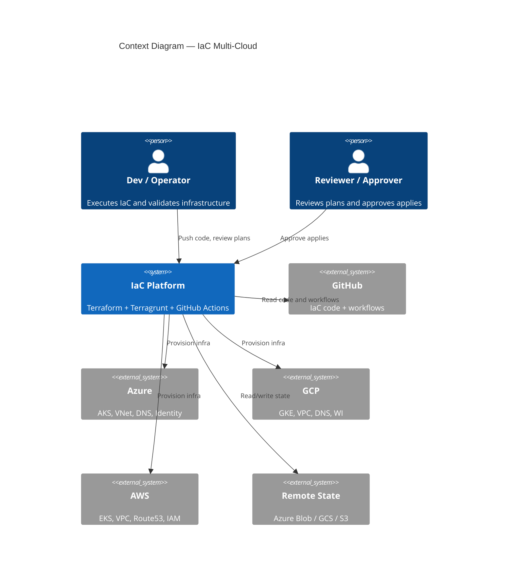

## 2.2 Actors and External Systems

| Actor / System | Role | Interaction |
|---|---|---|
| Dev / Operator | Develops IaC, reviews plans, validates | Push code, `terragrunt plan`, validation |
| Reviewer / Approver | Reviews plans, approves applies | GitHub PR review, environment approval |
| GitHub | Repository + GitHub Actions | Trigger pipelines, store code |
| Azure / GCP / AWS | Cloud providers | Clusters, networking, DNS, identity |
| Remote State | State backend | Terraform state with locking |

---

# 3. End-to-End IaC Provisioning Architecture

## 3.1 Complete End-to-End Diagram

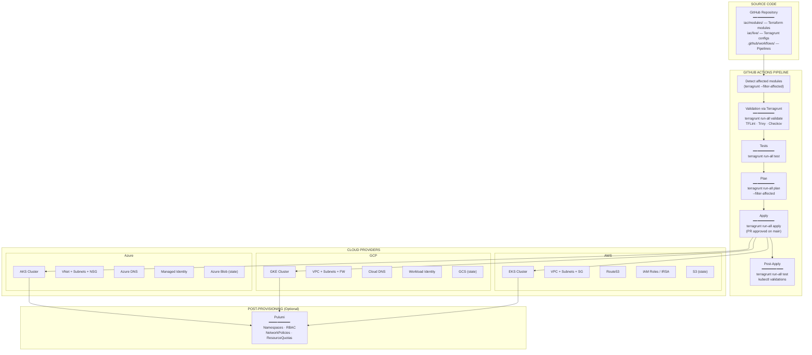

## 3.2 Detailed Flow by Phases

```mermaid
flowchart LR
    subgraph "Day 0 — Setup"
        P1["1. Create remote<br/>state backend"]
        P2["2. Configure<br/>service principal"]
        P3["3. Configure<br/>GitHub secrets"]

        P1 --> P2 --> P3
    end

    subgraph "Day 0 — Provisioning"
        P4["4. Push code<br/>to main"]
        P5["5. CI validates via Terragrunt<br/>TFLint+Trivy+Checkov"]
        P5B["6. terragrunt run-all test"]
        P6["7. terragrunt plan<br/>--filter-affected"]
        P7["8. PR approved"]
        P8["9. terragrunt apply<br/>--filter-affected"]

        P4 --> P5 --> P5B --> P6 --> P7 --> P8
    end

    subgraph "Day 0 — Base Config"
        P9["10. Namespaces +<br/>RBAC + Policies"]
        P10["11. terragrunt<br/>run-all test"]
        P11["12. kubectl<br/>validations"]

        P9 --> P10 --> P11
    end

    P3 --> P4
    P8 --> P9
```

---

# 4. Internal Cluster Architecture

## 4.1 Target Cluster Diagram

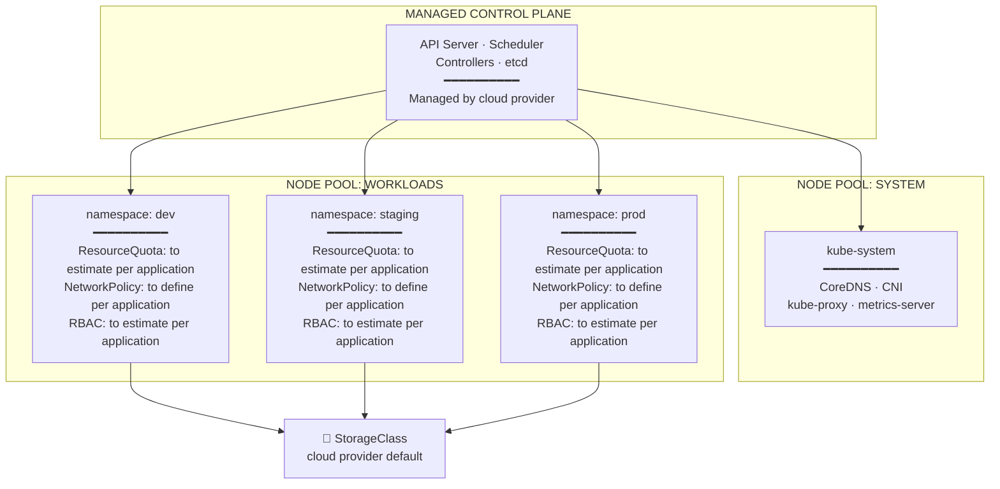

## 4.2 Node Pools and Workload Distribution

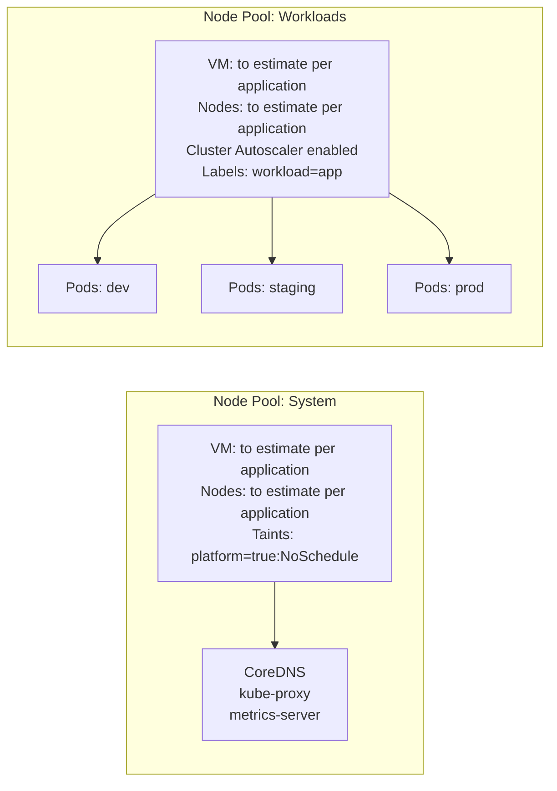

## 4.3 Cluster Design Decisions

| # | Decision | Justification |
|---|----------|---------------|
| 1 | **Managed cluster** | AKS/GKE/EKS — control plane managed by cloud |
| 2 | **Two node pools** | Separate system components from business workloads |
| 3 | **Namespaces per stage** | Logical dev/staging/prod separation with RBAC and policies |
| 4 | **NetworkPolicies** | Network isolation between namespaces (to define per application) |
| 5 | **ResourceQuotas** | Prevent one stage from consuming all resources (to estimate per application) |
| 6 | **Autoscaling** | Workloads node pool with Cluster Autoscaler enabled |

---

# 5. Multi-Cluster Design and Stage Separation

## 5.1 Multi-Cluster per Stage Diagram

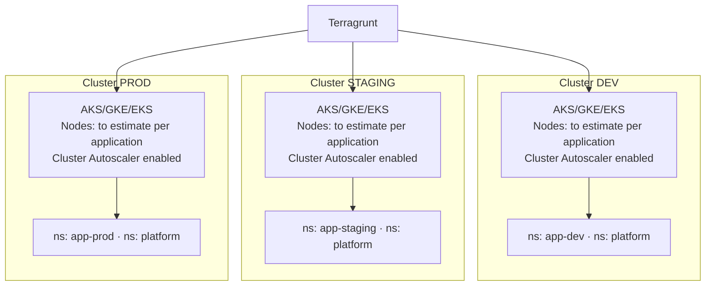

## 5.2 Single Cluster with Namespaces Diagram

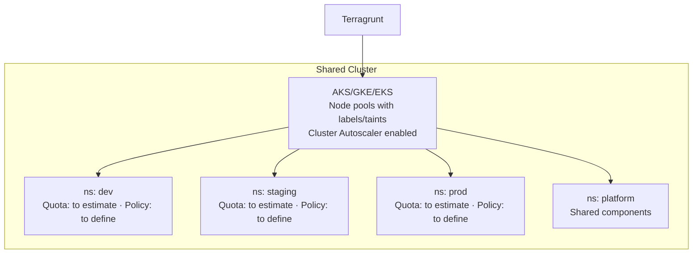

## 5.3 Hybrid Approach Diagram

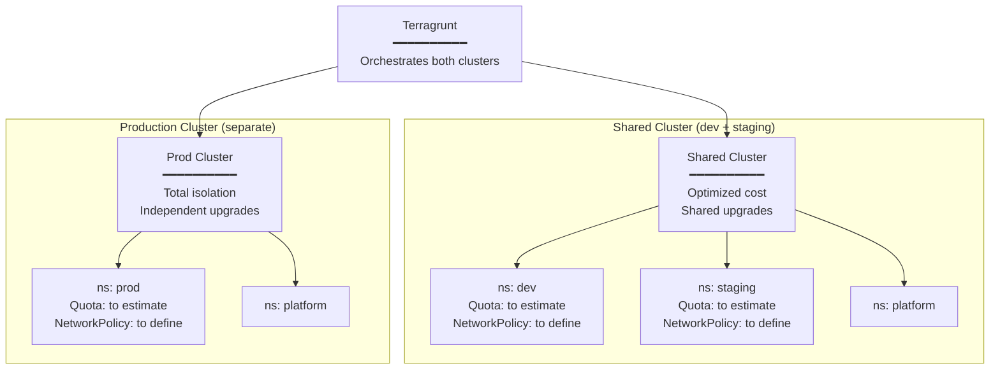

## 5.4 Namespace Isolation: RBAC, NetworkPolicies, ResourceQuotas

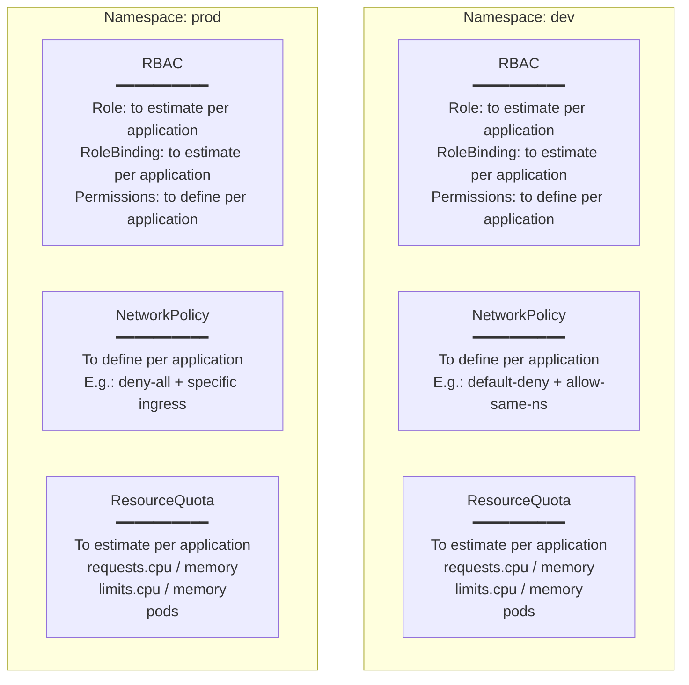

---

# 6. Network Architecture

## 6.1 Detailed Network Diagram

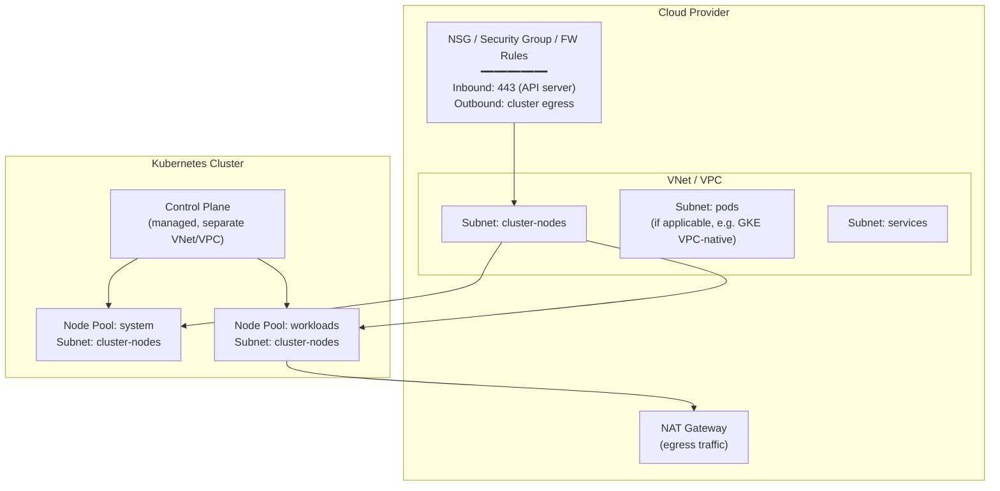

## 6.2 Network Traffic Flow

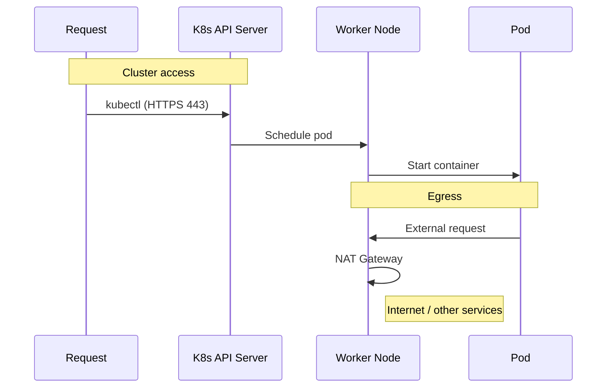

---

# 7. Identity and Security Architecture

## 7.1 Identity Diagram per Cloud

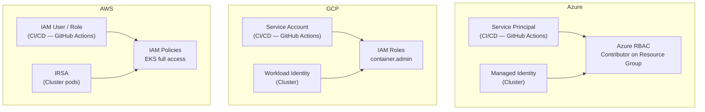

---

# 8. Terraform + Terragrunt Module Architecture

## 8.1 Module and Dependencies Diagram

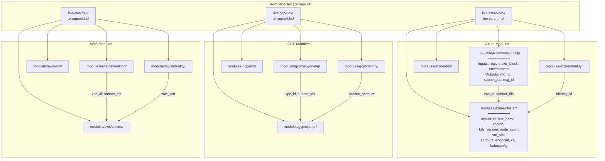

## 8.2 Complete Project Structure

```text
repo/
├── iac/
│   ├── modules/
│   │   ├── azure/
│   │   │   ├── cluster/
│   │   │   │   ├── main.tf
│   │   │   │   ├── variables.tf
│   │   │   │   ├── outputs.tf
│   │   │   │   ├── versions.tf
│   │   │   │   └── tests/
│   │   │   │       └── cluster_test.tftest.hcl
│   │   │   ├── networking/
│   │   │   │   ├── main.tf
│   │   │   │   ├── variables.tf
│   │   │   │   └── outputs.tf
│   │   │   ├── dns/
│   │   │   │   ├── main.tf
│   │   │   │   ├── variables.tf
│   │   │   │   └── outputs.tf
│   │   │   ├── identity/
│   │   │   │   ├── main.tf
│   │   │   │   ├── variables.tf
│   │   │   │   └── outputs.tf
│   │   │   └── remote-state/
│   │   │       ├── main.tf
│   │   │       ├── variables.tf
│   │   │       └── outputs.tf
│   │   ├── gcp/
│   │   │   ├── cluster/
│   │   │   │   └── ... (same structure)
│   │   │   ├── networking/
│   │   │   ├── dns/
│   │   │   ├── identity/
│   │   │   └── remote-state/
│   │   ├── aws/
│   │   │   ├── cluster/
│   │   │   │   └── ... (same structure)
│   │   │   ├── networking/
│   │   │   ├── dns/
│   │   │   ├── identity/
│   │   │   └── remote-state/
│   │   └── pulumi/                          # (Optional) In-cluster resources
│   │       ├── Pulumi.yaml
│   │       ├── Pulumi.dev.yaml
│   │       ├── Pulumi.prod.yaml
│   │       └── index.ts
│   ├── live/
│   │   ├── terragrunt.hcl              # Root config (DRY)
│   │   ├── azure/
│   │   │   ├── dev/
│   │   │   │   ├── networking/terragrunt.hcl
│   │   │   │   ├── cluster/terragrunt.hcl
│   │   │   │   └── env.hcl
│   │   │   ├── staging/
│   │   │   │   └── ...
│   │   │   └── prod/
│   │   │       └── ...
│   │   ├── gcp/
│   │   │   └── ...
│   │   └── aws/
│   │       └── ...
│   └── .tflint.hcl
├── .github/
│   └── workflows/
│       ├── iac-validate.yml
│       ├── iac-plan.yml
│       └── iac-apply.yml
└── docs/
```

## 8.3 Terragrunt DRY Flow Diagram

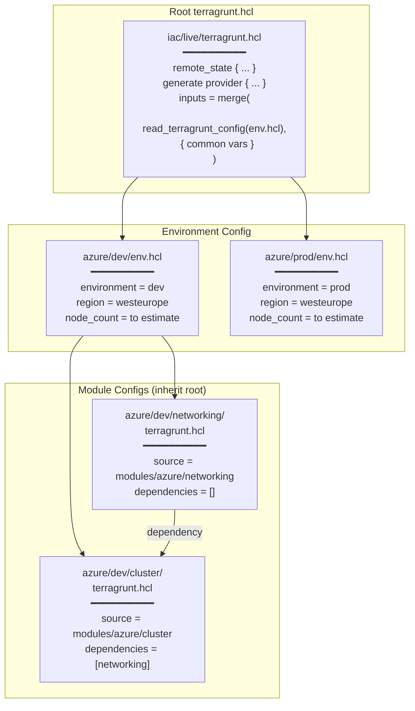

---

# 9. GitHub Actions Pipeline — Detailed Diagram

## 9.1 Complete Pipeline Diagram

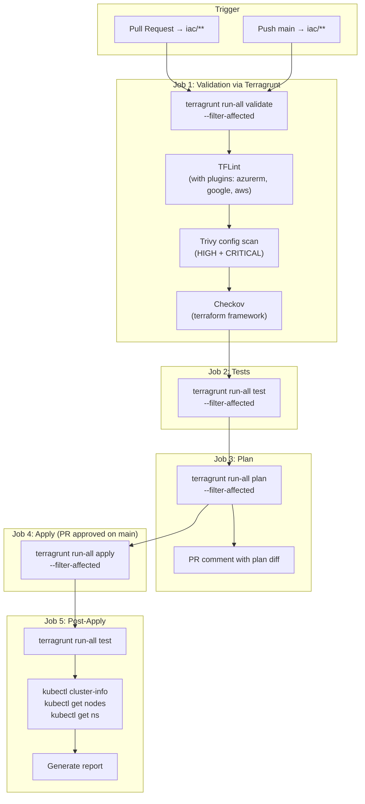

## 9.2 Optimized Execution Diagram

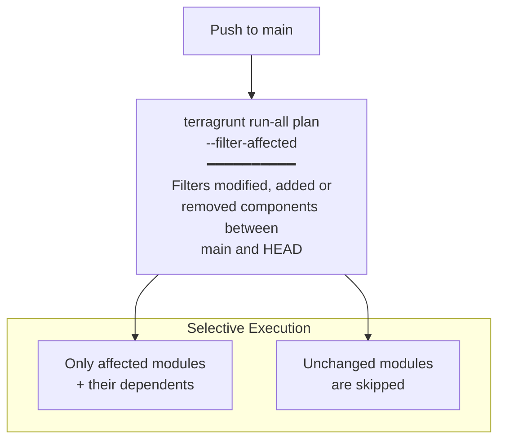

## 9.3 Pipeline Sequence Diagram

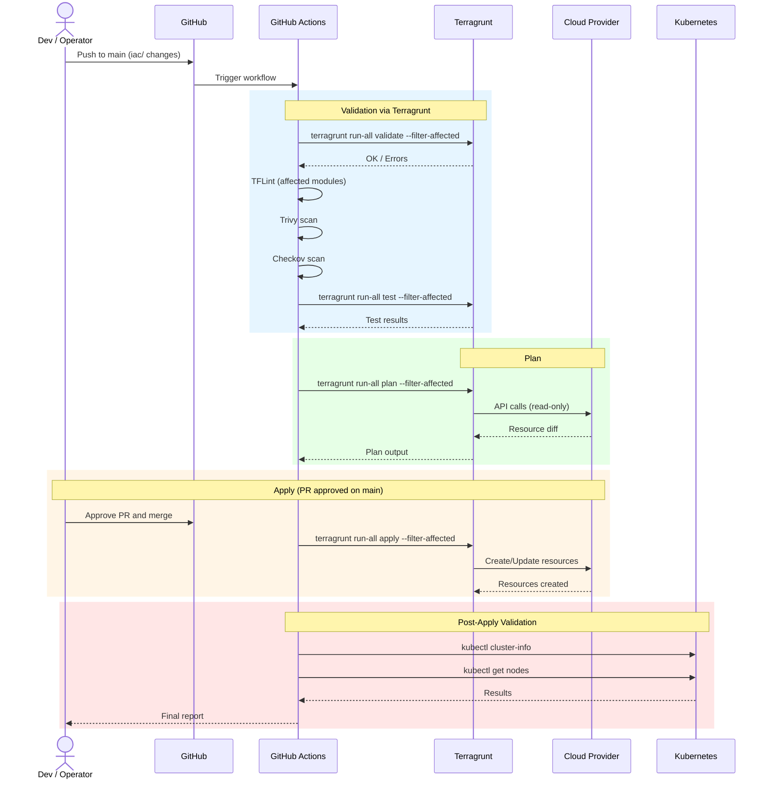

---

# 10. IaC Validation Pipeline: TFLint, Trivy, Checkov

## 10.1 Validation Flow Diagram

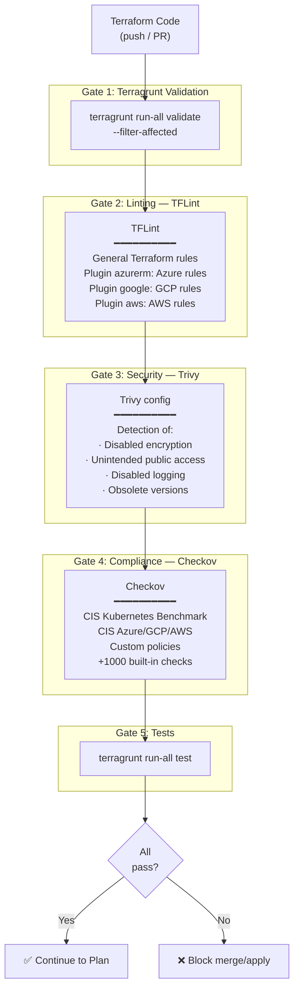

---

# 11. State and Persistence Architecture

## 11.1 State Management Diagram

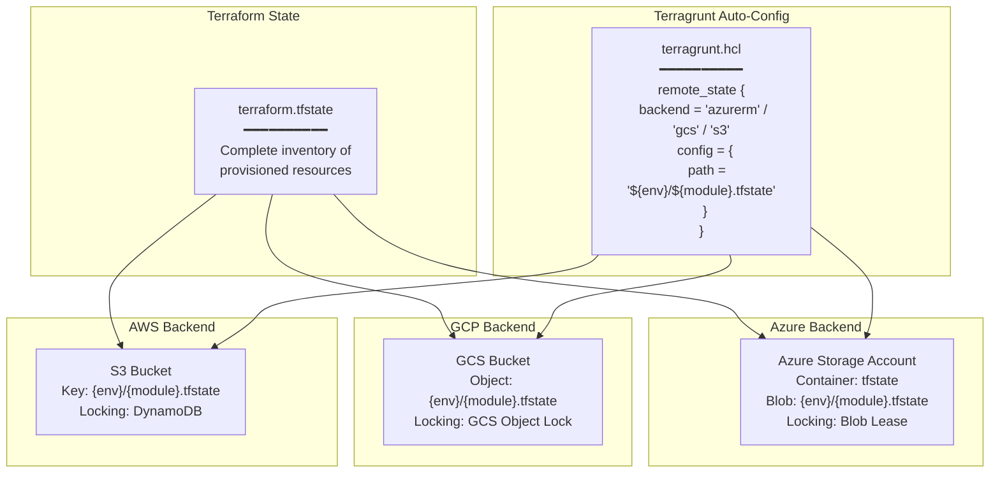

---

# 12. Cloud-Agnostic Architecture: AKS vs GKE vs EKS

## 12.1 Comparative Layer Diagram

```mermaid
flowchart TB
    subgraph "PORTABLE LAYER (Identical)"
        L_TG["Terragrunt Config<br/>Same structure<br/>--filter-affected"]
        L_GHA["GitHub Actions<br/>Same pipeline"]
        L_TOOLS["TFLint · Trivy · Checkov<br/>Same validations"]
        L_TESTS["terragrunt run-all test<br/>Same pattern"]
        L_VARS["Variables Contract<br/>Same contract"]
    end

    subgraph "AZURE LAYER"
        AZ_MOD["module: azure/cluster<br/>provider: azurerm"]
        AZ_NET["VNet + Subnet + NSG"]
        AZ_DNS["Azure DNS"]
        AZ_ID["Managed Identity"]
        AZ_STATE["Azure Blob"]
    end

    subgraph "GCP LAYER"
        GCP_MOD["module: gcp/cluster<br/>provider: google"]
        GCP_NET["VPC + Subnet + FW"]
        GCP_DNS["Cloud DNS"]
        GCP_ID["Workload Identity"]
        GCP_STATE["GCS"]
    end

    subgraph "AWS LAYER"
        AWS_MOD["module: aws/cluster<br/>provider: aws"]
        AWS_NET["VPC + Subnet + SG"]
        AWS_DNS["Route53"]
        AWS_ID["IAM / IRSA"]
        AWS_STATE["S3 + DynamoDB"]
    end

    L_TG --> AZ_MOD
    L_TG --> GCP_MOD
    L_TG --> AWS_MOD
```

## 12.2 Portability Matrix

| Aspect | Azure (AKS) | GCP (GKE) | AWS (EKS) | Portability |
|---------|-------------|-----------|-----------|--------------|
| Cluster | `azurerm_kubernetes_cluster` | `google_container_cluster` | `aws_eks_cluster` | Different module, same contract |
| Networking | VNet + Subnet + NSG | VPC + Subnet + FW | VPC + Subnet + SG | Different module, same contract |
| DNS | Azure DNS | Cloud DNS | Route53 | Different module, same contract |
| Identity | Managed Identity | Workload Identity | IRSA | Different config |
| State backend | Azure Blob | GCS | S3 + DynamoDB | Terragrunt abstracts it |
| Node pools | AKS node pools | GKE node pools | EKS managed node groups | Different module |
| Terragrunt config | ✅ Identical | ✅ Identical | ✅ Identical | ✅ Portable |
| GitHub Actions | ✅ Identical | ✅ Identical | ✅ Identical | ✅ Portable |
| TFLint/Trivy/Checkov | ✅ Identical | ✅ Identical | ✅ Identical | ✅ Portable |

---

# 13. Pulumi for In-Cluster Resources — Diagram

```mermaid
flowchart TB
    subgraph "Terraform + Terragrunt (Cloud Infra)"
        TF_OUT["Cluster Outputs<br/>━━━━━━━━━━<br/>cluster_endpoint<br/>ca_certificate<br/>kubeconfig_path"]
    end

    subgraph "Pulumi (In-Cluster Resources)"
        PULUMI_PROG["Pulumi Program (TypeScript)<br/>━━━━━━━━━━<br/>import * as k8s from '@pulumi/kubernetes'<br/><br/>// Consume TF outputs<br/>const provider = new k8s.Provider('k8s', {<br/>  kubeconfig: tfOutputs.kubeconfig<br/>})"]

        subgraph "Created Resources"
            NS_DEV["Namespace: dev"]
            NS_STG["Namespace: staging"]
            NS_PROD["Namespace: prod"]
            RBAC["RBAC Roles + Bindings<br/>(to estimate per application)"]
            NP["NetworkPolicies<br/>(to define per application)"]
            RQ["ResourceQuotas<br/>(to estimate per application)"]
        end

        PULUMI_PROG --> NS_DEV
        PULUMI_PROG --> NS_STG
        PULUMI_PROG --> NS_PROD
        PULUMI_PROG --> RBAC
        PULUMI_PROG --> NP
        PULUMI_PROG --> RQ
    end

    TF_OUT -->|"kubeconfig"| PULUMI_PROG
```

---

# 14. Terraform Test Architecture

## 14.1 Test Flow Diagram

```mermaid
flowchart TB
    subgraph "Native Terraform Tests"
        TEST_FILE[".tftest.hcl files<br/>━━━━━━━━━━<br/>Located in modules/{provider}/cluster/tests/"]

        subgraph "Test Types"
            PLAN_TEST["Plan Tests<br/>━━━━━━━━━━<br/>command = plan<br/>Validates configuration<br/>without creating resources"]
            APPLY_TEST["Apply Tests (optional)<br/>━━━━━━━━━━<br/>command = apply<br/>Creates real resources<br/>and validates state"]
        end

        subgraph "Assertions"
            ASSERT1["assert: cluster name"]
            ASSERT2["assert: correct region"]
            ASSERT3["assert: node count"]
            ASSERT4["assert: K8s version"]
            ASSERT5["assert: outputs present"]
        end

        TEST_FILE --> PLAN_TEST
        TEST_FILE --> APPLY_TEST
        PLAN_TEST --> ASSERT1
        PLAN_TEST --> ASSERT2
        PLAN_TEST --> ASSERT3
        APPLY_TEST --> ASSERT4
        APPLY_TEST --> ASSERT5
    end

    subgraph "Execution"
        LOCAL["terraform test (local)"]
        CI["GitHub Actions (CI)"]
        TG_CMD["terragrunt run-all test"]
        TG_HOOK["Terragrunt after_hook"]
    end

    TEST_FILE --> LOCAL
    TEST_FILE --> CI
    TEST_FILE --> TG_CMD
    TEST_FILE --> TG_HOOK
```

---

# 15. UML Deployment Diagram

```mermaid
flowchart TB
    subgraph "Node: Dev / Operator Workstation"
        TF_CLI["Terraform / OpenTofu CLI"]
        TG_CLI["Terragrunt CLI"]
        KUBECTL["kubectl"]
        PULUMI_CLI["Pulumi CLI (optional)"]
    end

    subgraph "Node: GitHub"
        GH_REPO["Repository<br/>iac/ + .github/workflows/"]
        GH_ACTIONS["GitHub Actions Runners"]
    end

    subgraph "Node: Cloud Provider"
        subgraph "Kubernetes Cluster"
            subgraph "Control Plane"
                API["API Server"]
                ETCD["etcd"]
            end

            subgraph "Node Pool: System"
                CORE["CoreDNS · CNI<br/>kube-proxy"]
            end

            subgraph "Node Pool: Workloads"
                NS_D["ns: dev"]
                NS_S["ns: staging"]
                NS_P["ns: prod"]
            end
        end

        CLOUD_NET["VNet / VPC"]
        CLOUD_DNS["DNS Zone"]
        CLOUD_STATE["State Backend"]
        CLOUD_ID["Identity"]
    end

    TF_CLI --> API
    TG_CLI --> TF_CLI
    KUBECTL --> API
    GH_ACTIONS --> TG_CLI
    TG_CLI --> CLOUD_STATE
    GH_REPO --> GH_ACTIONS
```

---

# 16. Main Flow Guides

## 16.1 Flow: New Cluster from Scratch

```mermaid
flowchart TB
    A["1. Create remote backend<br/>(iac/modules/{provider}/remote-state)"]
    B["2. Configure service principal<br/>and GitHub secrets"]
    C["3. Create env.hcl for<br/>the new environment"]
    D["4. Create terragrunt.hcl<br/>for networking"]
    E["5. Create terragrunt.hcl<br/>for cluster"]
    F["6. Push to main"]
    G["7. GitHub Actions:<br/>validate → test → plan → apply"]
    H["8. terragrunt run-all test"]
    I["9. kubectl validations"]
    J["10. ✅ Cluster ready"]

    A --> B --> C --> D --> E --> F --> G --> H --> I --> J
```

## 16.2 Flow: Change in an Existing Module

```mermaid
flowchart TB
    A["1. Modify module<br/>(e.g.: modules/azure/cluster/)"]
    B["2. Update tests<br/>if needed"]
    C["3. Push to feature branch"]
    D["4. PR: validate + test + plan<br/>(automatic)"]
    E["5. Review plan diff"]
    F["6. Approve PR and merge to main"]
    G["7. GitHub Actions detects<br/>only affected modules<br/>(--filter-affected)"]
    H["8. Apply only environments<br/>using that module"]
    I["9. Post-apply tests"]
    J["10. ✅ Change applied"]

    A --> B --> C --> D --> E --> F --> G --> H --> I --> J
```

## 16.3 Flow: Add New Environment

```mermaid
flowchart TB
    A["1. Create folder<br/>live/{cloud}/{new-env}/"]
    B["2. Create env.hcl<br/>with environment variables"]
    C["3. Create terragrunt.hcl<br/>for each required module"]
    D["4. Modules are reused<br/>(DRY via Terragrunt)"]
    E["5. Push to main"]
    F["6. GitHub Actions:<br/>validate → test → plan → apply"]
    G["7. ✅ New environment ready"]

    A --> B --> C --> D --> E --> F --> G
```

---

# 17. References

### Technical References
- [Terraform — Official Documentation](https://developer.hashicorp.com/terraform/docs)
- [Terragrunt — Official Documentation](https://terragrunt.gruntwork.io/docs/)
- [Terragrunt --filter-affected](https://terragrunt.gruntwork.io/docs/reference/cli-options/#filter-affected)
- [OpenTofu — Official Documentation](https://opentofu.org/docs/)
- [Pulumi — Kubernetes Provider](https://www.pulumi.com/registry/packages/kubernetes/)
- [TFLint — GitHub Repository](https://github.com/terraform-linters/tflint)
- [Trivy — Official Documentation](https://aquasecurity.github.io/trivy/)
- [Checkov — Official Documentation](https://www.checkov.io/1.Welcome/Quick%20Start.html)
- [GitHub Actions — Official Documentation](https://docs.github.com/en/actions)
- [Microsoft Learn — AKS](https://learn.microsoft.com/en-us/azure/aks/)
- [Google Cloud — GKE](https://cloud.google.com/kubernetes-engine/docs/)
- [AWS — EKS](https://docs.aws.amazon.com/eks/)

---

## NOTICE

This work is licensed under the [CC-BY-4.0](https://creativecommons.org/licenses/by/4.0/legalcode).

* SPDX-License-Identifier: CC-BY-4.0
* SPDX-FileCopyrightText: 2026 Contributors to the Eclipse Foundation
* Source URL: <https://github.com/eclipse-tractusx/tractus-x-umbrella>
